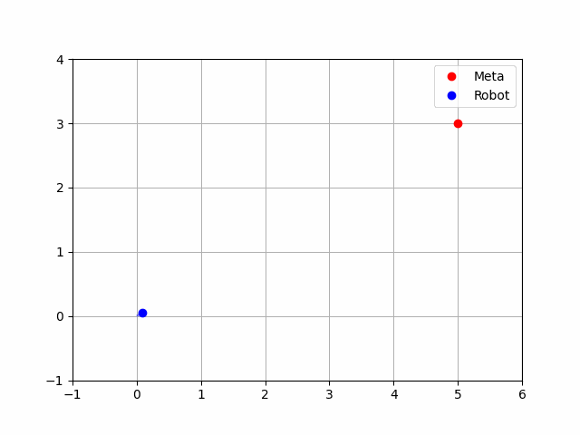

# Tutoriales

## Creación de un espacio de trabajo

A continuación, se realiza la creación de un espacio de trabajo denominado `ros2_ws`

***Creación del espacio de trabajo***

```bash
mkdir -p ~/ros2_ws/src
cd ~/ros2_ws
colcon build
echo "source ~/ros2_ws/install/setup.bash" >> ~/.bashrc
source ~/.bashrc
```
---


## Creación Paquetes

Una vez construido el espacio de trabajo, se debe realizar la construcción de un paquete de ROS2, en este caso se utilizará un paquete compatible con python, y tendrá las dependencias de `std_msgs`

1. Crear el paquete

```bash
cd ~/ros2_ws/src
ros2 pkg create mi_pkg_python --build-type ament_python --dependencies rclpy std_msgs
```

2. Estructura generada

```
mi_pkg_python/
├── mi_pkg_python/
│   └── __init__.py
├── package.xml
├── resource/
│   └── mi_pkg_python
├── setup.py
├── setup.cfg
└── test/
```

3. Compilar el paquete

```bash
cd ~/ros2_ws
colcon build --packages-select mi_pkg_python
```
## Nodos publicador y Suscriptor
Una vez compilado el paquete, se realiza la creación de los nodos publicador y suscriptor.

1. Crear el archivo del nodo publicador

```bash
touch mi_pkg_python/mi_pkg_python/publicador.py
```

2. Código del nodo en `publicador.py`

```python
# Importa la librería principal de ROS 2 en Python
import rclpy

# Importa la clase base Node, que representa un nodo en ROS 2
from rclpy.node import Node

# Importa el tipo de mensaje estándar String del paquete std_msgs
from std_msgs.msg import String

# Define una clase que extiende Node, representando un nodo que publica mensajes
class MinimalPublisher(Node):

    def __init__(self):
        # Llama al constructor de la clase padre (Node) con el nombre del nodo
        super().__init__('minimal_publisher')

        # Crea un publicador que publica mensajes del tipo String en el topic 'topic' con una cola de 10 mensajes
        self.publisher_ = self.create_publisher(String, 'topic', 10)

        # Crea un temporizador que ejecuta la función `timer_callback` cada 0.5 segundos
        self.timer = self.create_timer(0.5, self.timer_callback)

        # Contador para numerar los mensajes
        self.i = 0

    # Función que se ejecuta cada 0.5 segundos
    def timer_callback(self):
        # Crea un mensaje tipo String
        msg = String()

        # Asigna el contenido del mensaje
        msg.data = f'Hello World: {self.i}'

        # Publica el mensaje en el topic
        self.publisher_.publish(msg)

        # Muestra por consola el mensaje publicado
        self.get_logger().info(f'Publishing: "{msg.data}"')

        # Incrementa el contador
        self.i += 1

# Punto de entrada principal del programa
def main(args=None):
    # Inicializa el sistema de nodos de ROS 2
    rclpy.init(args=args)

    try:
        # Instancia el nodo y empieza a ejecutarlo
        node = MinimalPublisher()

        # Mantiene al nodo activo, escuchando eventos y timers
        rclpy.spin(node)

    except KeyboardInterrupt:
        # Permite salir con Ctrl+C sin error
        pass

    finally:
        # Destruye el nodo de forma limpia y apaga el sistema ROS 2
        node.destroy_node()
        rclpy.shutdown()

# Verifica si el archivo se está ejecutando directamente (no importado)
if __name__ == '__main__':
    main()
```

3. Crear el nodo `suscriptor.py` en la misma dirección donde se encuentra el nodo publicador.py

```python

# Importa la librería principal de ROS 2 para Python
import rclpy

# Importa la clase base para crear nodos en ROS 2
from rclpy.node import Node

# Importa el tipo de mensaje estándar String desde std_msgs
from std_msgs.msg import String

# Define una clase que hereda de Node, representa el nodo suscriptor
class MinimalSubscriber(Node):

    # Método constructor de la clase
    def __init__(self):
        # Inicializa el nodo con el nombre 'minimal_subscriber'
        super().__init__('minimal_subscriber')

        # Crea una suscripción al tópico 'topic'
        # Tipo de mensaje: String
        # Función de callback: self.listener_callback
        # Tamaño de la cola: 10 mensajes
        self.subscription = self.create_subscription(
            String,
            'topic',
            self.listener_callback,
            10)

        # Esta línea asegura que la variable no sea optimizada por el compilador (aunque no es obligatorio en Python)
        self.subscription

    # Función que se llama cada vez que se recibe un mensaje en el tópico
    def listener_callback(self, msg):
        # Imprime en consola el contenido del mensaje recibido
        self.get_logger().info('I heard: "%s"' % msg.data)

# Función principal que lanza el nodo
def main(args=None):
    # Inicializa el sistema de ROS 2
    rclpy.init(args=args)

    # Crea una instancia del nodo suscriptor
    minimal_subscriber = MinimalSubscriber()

    # Mantiene el nodo corriendo escuchando datos (callback se ejecutará cuando lleguen mensajes)
    rclpy.spin(minimal_subscriber)

    # Cuando se detiene (Ctrl+C o cierre), se destruye el nodo explícitamente (opcional)
    minimal_subscriber.destroy_node()

    # Finaliza la ejecución del sistema ROS 2
    rclpy.shutdown()

# Esta verificación permite que el nodo se ejecute solo si el script se corre directamente
if __name__ == '__main__':
    main()
```

4. Registrar los nodos en `setup.py`

```python
entry_points={
    'console_scripts': [
        'publicador1 = mi_pkg_python.publicador:main',
        'suscriptor1 = mi_pkg_python.suscriptor:main',
    ],
},
```

5. Compilar el paquete

```bash
cd ~/ros2_ws
colcon build --packages-select mi_pkg_python
```

6. Ejecutar el nodo

```bash
ros2 run mi_pkg_python publicador1
```

## Paquetes con mensajes personalizados

Los mensajes personalizados permiten crear un paquete exclusivo para generar estructuras personales de mensajes en ROS2 usando `ament_cmake`, ademas de poder integrarlos a otros paquetes.

Antes de continuar con la generación de mensajes es necesario revisar, que tipos de mensajes están disponibles:


```bash
ros2 interface list | grep msg
```

y la revisión de los parámetros del mensaje se realiza mediante el comand:


```bash
ros2 interface show [tipo de mensaje]
```

---

Ahora, se va a crear un paquete llamado `avig_msg` que defina un mensaje personalizado `AprilTagPixel.msg` con los siguientes campos:

```
string id
int32 posx
int32 posy
```

---


1. Crear el paquete

Desde la carpeta `src` del workspace:

```bash
ros2 pkg create avig_msg --build-type ament_cmake
```

Este comando genera la estructura básica del paquete `avig_msg`.

---

2. Crear el mensaje personalizado

```bash
cd avig_msg
mkdir msg
gedit msg/AprilTagPixel.msg
```

Contenido:

```
int32 id
float32 posx
float32 posy
int32 orden
float32 dist
```

Este archivo define un mensaje simple para enviar datos de detección de un tag.

---

3. Mensajes compuestos 

Se puede crear mensajes que tengan anidada mas información en este caso se va a crear un array de `AprilTagPixel.msg`.

Dentro del paquete `avig_msg`
```bash
cd msg
gedit AprilTagPixelArray.msg
```

Contenido:

```
AprilTagPixel[] tags
```

4. Editar `CMakeLists.txt`

Editar `CMakeLists.txt` para incluir soporte de mensajes:

```cmake
cmake_minimum_required(VERSION 3.8)
project(avig_msg)

find_package(ament_cmake REQUIRED)
find_package(rosidl_default_generators REQUIRED)
find_package(builtin_interfaces REQUIRED)

rosidl_generate_interfaces(${PROJECT_NAME}
  "msg/AprilTagPixel.msg"
  "msg/AprilTagPixelArray.msg"
  DEPENDENCIES builtin_interfaces
)

ament_export_dependencies(rosidl_default_runtime)
ament_package()
```

***¿Por qué?***
- `rosidl_default_generators` genera los bindings del mensaje.
- `builtin_interfaces` es requerido si se usan tipos nativos como `string`, `int32`.
- `ament_export_dependencies` permite que otros paquetes importen estos mensajes.

---

5. Editar `package.xml`

Agregar las dependencias necesarias:

```xml
<buildtool_depend>ament_cmake</buildtool_depend>
<build_depend>rosidl_default_generators</build_depend>
<exec_depend>rosidl_default_runtime</exec_depend>
<member_of_group>rosidl_interface_packages</member_of_group>
```

***¿Por qué?***
Estas etiquetas aseguran que el sistema de compilación de ROS 2 reconozca este paquete como generador de interfaces.

---

6. Compilar e instalar

Desde la raíz del workspace:

```bash
cd ~/ros2_ws
colcon build --packages-select avig_msg
source install/setup.bash
```

---

7. Verificar el mensaje

```bash
ros2 interface show avig_msg/msg/AprilTagPixel
```

---

8. Usar el mensaje en otro paquete


En el paquete creado anteriormente de Python  `mi_pkg_python`:

1. En `package.xml`:

```xml
<exec_depend>avig_msg</exec_depend>
```

2. En el código Python:

```python
from avig_msg.msg import AprilTagPixel
```

3. Usarlo en un publicador o suscriptor como cualquier otro mensaje.
---

## April-Tags

Un **AprilTag** es un tipo de marcador visual 2D diseñado para permitir la detección robusta, precisa y rápida en entornos de visión por computadora y robótica. Fue desarrollado en el Laboratorio de Robótica de la Universidad de Michigan.

**Características principales:**

- 🔳 Patrón en blanco y negro con bordes codificados.
- 📍 Cada tag tiene un **ID único**.
- 🎯 Puede ser detectado desde distintos ángulos y con iluminación variable.
- ⚡ Su detección es **más rápida y robusta** que QR o ARTags para propósitos robóticos.

---

**Usos comunes de AprilTags en Robótica**

| Aplicación                | Descripción                                                                 |
|---------------------------|-----------------------------------------------------------------------------|
| 📍 Localización absoluta   | Identificar una posición fija en el mapa mediante un tag conocido.          |
| 🤖 Seguimiento de objetos  | Seguir la posición de un tag en tiempo real (e.g. manipulación, drones).   |
| 🎯 Calibración de cámaras  | Calibrar parámetros intrínsecos y extrínsecos de una cámara.               |
| 🗺️ SLAM / Navegación       | Complementar sensores como LiDAR o IMU en mapeo y navegación autónoma.     |
| 🤝 Interacción humano-robot| Identificar objetos, posiciones, o áreas accesibles visualmente.          |

---


**Librería usada**

Usamos la librería `pupil_apriltags`, una implementación rápida del detector.  
Es eficiente, moderna, y puede ser utilizada en aplicaciones en tiempo real.

El resto de aplicaciones de AprilTag se puede revisar en los siguintes repositorios:

[April-Tags](https://ftc-docs.firstinspires.org/en/latest/apriltag/vision_portal/apriltag_intro/apriltag-intro.html)
[Git-hub-Tags](https://github.com/rgov/apriltag-pdfs/tree/main/tag36h11/us_letter/100mm)


***Instalación:***

```bash
pip install pupil-apriltags opencv-python
```
---

***Detección en Python puro (sin ROS)***

```python
import cv2
from pupil_apriltags import Detector

def main():
    # Abre la cámara (0 = cámara predeterminada)
    cap = cv2.VideoCapture(0)

    if not cap.isOpened():
        print("No se pudo acceder a la cámara.")
        return

    # Configurar el detector de AprilTags
    at_detector = Detector(
        families='tag36h11',
        nthreads=1,
        quad_decimate=1.0,
        quad_sigma=0.0,
        refine_edges=True,
        decode_sharpening=0.25,
        debug=False
    )

    # Nombre de la ventana
    window_name = 'AprilTag Detector - tag36h11'

    # Hacer la ventana redimensionable
    cv2.namedWindow(window_name, cv2.WINDOW_NORMAL)
    cv2.resizeWindow(window_name, 800, 600)  # Ancho x Alto en píxeles

    print("Cámara activa. Presiona 'q' para salir.")

    while True:
        ret, frame = cap.read()
        if not ret:
            print("No se pudo leer el frame.")
            break

        # Convertir imagen a escala de grises
        gray = cv2.cvtColor(frame, cv2.COLOR_BGR2GRAY)

        # Detectar etiquetas AprilTag
        detections = at_detector.detect(gray)

        for detection in detections:
            tag_id = detection.tag_id
            print(f"Tag detectado: {tag_id}")

            # Dibujar un círculo en el centro del tag
            center = (int(detection.center[0]), int(detection.center[1]))
            cv2.circle(frame, center, 10, (0, 255, 0), 2)

        # Mostrar imagen con detecciones
        cv2.imshow(window_name, frame)

        # Salir si se presiona la tecla 'q'
        if cv2.waitKey(1) & 0xFF == ord('q'):
            break

    # Liberar recursos
    cap.release()
    cv2.destroyAllWindows()
    print("Cámara cerrada.")

if __name__ == '__main__':
    main()
```

Para el uso de april-tags, es importante tener en cuenta las características de la cámara.


***Nodo ROS 2 que publica detección de AprilTags***

Para el siguiente nodo, se utulizará los mensajes previamente creados `AprilTagPixel` y `AprilTagPixelArray`

Este nodo se ejecuta en ROS 2 y **publica los datos detectados** (ID y posición en píxeles) en un tópico llamado `/apriltag_pixels`.

```python
import cv2
from pupil_apriltags import Detector
import rclpy
from rclpy.node import Node

from std_msgs.msg import String
from avig_msg.msg import AprilTagPixel, AprilTagPixelArray

class AprilTagPixelPublisher(Node):
    def __init__(self):
        super().__init__('apriltag_pixel_publisher')

        self.publisher_data = self.create_publisher(AprilTagPixelArray, 'apriltag_pixels_arreglo', 1)

        self.cap = cv2.VideoCapture(0)
        self.cap.set(cv2.CAP_PROP_FRAME_WIDTH, 640)
        self.cap.set(cv2.CAP_PROP_FRAME_HEIGHT, 480)
        self.cap.set(cv2.CAP_PROP_FPS, 30)

        if not self.cap.isOpened():
            self.get_logger().error("No se pudo acceder a la cámara.")
            exit()

        self.at_detector = Detector(families='tag36h11', nthreads=4)

        # Crear ventana redimensionable (solo si se usa visualización)
        cv2.namedWindow("AprilTag View", cv2.WINDOW_NORMAL)
        cv2.resizeWindow("AprilTag View", 800, 600)

        self.timer = self.create_timer(1.0 / 30.0, self.timer_callback)
        self.get_logger().info("Nodo AprilTag iniciado.")

    def timer_callback(self):
        ret, frame = self.cap.read()
        if not ret:
            self.get_logger().warn(" No se pudo leer el frame.")
            return

        gray = cv2.cvtColor(frame, cv2.COLOR_BGR2GRAY)
        detections = self.at_detector.detect(gray)

        msg_arreglo = AprilTagPixelArray()
        for det in detections:
            tag_id = det.tag_id
            center_px = det.center
            msg = AprilTagPixel()
            msg.id = tag_id
            msg.posx = float(center_px[0])
            msg.posy = float(center_px[1])
            msg_arreglo.tags.append(msg)
        self.publisher_data.publish(msg_arreglo)
        # Visualizacion
        self.visualizar_detecciones(frame, detections)

    def visualizar_detecciones(self, frame, detections):
        """Muestra la imagen con círculos e ID de tags detectados."""
        for det in detections:
            center = (int(det.center[0]), int(det.center[1]))
            cv2.circle(frame, center, 8, (0, 255, 0), 2)
            cv2.putText(frame, f"ID:{det.tag_id}", (center[0] + 10, center[1] - 10),
                        cv2.FONT_HERSHEY_SIMPLEX, 0.6, (255, 0, 0), 2)

        cv2.imshow("AprilTag View", frame)
        if cv2.waitKey(1) & 0xFF == ord('q'):
            self.get_logger().info(" 'q' presionado. Saliendo.")
            self.cap.release()
            cv2.destroyAllWindows()
            rclpy.shutdown()

    def destroy_node(self):
        self.cap.release()
        cv2.destroyAllWindows()
        super().destroy_node()

def main(args=None):
    rclpy.init(args=args)
    node = AprilTagPixelPublisher()
    try:
        rclpy.spin(node)
    except KeyboardInterrupt:
        node.destroy_node()
        rclpy.shutdown()

if __name__ == '__main__':
    main()


```
Se puede utilizar diferentes variaciones para uso de apriltags con ROS2, para poder usar un formato compatible con las imágenes de ROS se debe utilizar el tipo de mensaje `sensor_msgs` y agregar esta dependencia en el paquete creado.

```python

import cv2
from pupil_apriltags import Detector
import rclpy
from rclpy.node import Node
from avig_msg.msg import AprilTagPixel, AprilTagPixelArray
from sensor_msgs.msg import Image

from cv_bridge import CvBridge

class AprilTagPixelPublisher(Node):
    def __init__(self):
        super().__init__('apriltag_pixel_publisher')

        # Publicador para ID y coordenadas en píxeles (bruto)
        self.publisher_data = self.create_publisher(AprilTagPixelArray, 'apriltag_pixels', 1)
        # Publicador para imagen tipo image_raw
        self.publisher_image = self.create_publisher(Image, 'image_raw', 1)
        self.bridge = CvBridge()

        # Configurar cámara
        self.cap = cv2.VideoCapture(0)
        self.cap.set(cv2.CAP_PROP_FRAME_WIDTH, 1280)
        self.cap.set(cv2.CAP_PROP_FRAME_HEIGHT, 720)
        self.cap.set(cv2.CAP_PROP_FPS, 30)

        if not self.cap.isOpened():
            self.get_logger().error("No se pudo acceder a la cámara.")
            exit()

        # Configurar detector de AprilTags
        self.at_detector = Detector(families='tag36h11', nthreads=4)

        # Temporizador a 30 Hz
        self.timer = self.create_timer(1.0 / 30.0, self.timer_callback)
        self.get_logger().info("Nodo de detección AprilTag iniciado (modo simple sin calibración).")

    def timer_callback(self):
        ret, frame = self.cap.read()
        if not ret:
            self.get_logger().warn("No se pudo leer el frame.")
            return

        gray = cv2.cvtColor(frame, cv2.COLOR_BGR2GRAY)
        detections = self.at_detector.detect(gray)
        msg_arreglo = AprilTagPixelArray()

        for det in detections:
            tag_id = det.tag_id
            center_px = det.center  # coordenadas (x, y) en píxeles
            msg = AprilTagPixel()
            msg.id = tag_id
            msg.posx = float(center_px[0])
            msg.posy = float(center_px[1])
            msg_arreglo.tags.append(msg)

        self.publisher_data.publish(msg_arreglo)

        # Publicar la imagen como sensor_msgs/Image
        img_msg = self.bridge.cv2_to_imgmsg(frame, encoding='bgr8')
        self.publisher_image.publish(img_msg)

    def destroy_node(self):
        self.cap.release()
        super().destroy_node()

def main(args=None):
    rclpy.init(args=args)
    node = AprilTagPixelPublisher()
    try:
        rclpy.spin(node)
    except KeyboardInterrupt:
        node.destroy_node()
        rclpy.shutdown()

if __name__ == '__main__':
    main()
```

## Servicios personalizados

En el servicio personalizado se agrega la funcionalidad de una Heuristica al sistema de control del robot.

***Definición general***
Una heurística es una regla, método o estrategia que simplifica la toma de decisiones y permite encontrar soluciones aproximadas en situaciones complejas, donde el cálculo exacto sería muy costoso o imposible.

Para ello, se establece un servicio que tiene como requerimiento  el tipo de mensaje `AprilTagPixelArray` y como respuesta un `AprilTagPixel`

1. Creación del archivo srv

Dentro del paquete `avig_msg`

```bash
mkdir srv
cd srv
gedit Heuristica.srv
```
Contenido:
```
avig_msg/AprilTagPixelArray tags_in
---
avig_msg/AprilTagPixel tag_out
```

Esto indica que el servicio recibirá una lista de tags y devolverá solo uno como resultado.

---

2. Configurar CMakeLists.txt

Agrega lo siguiente si no está presente:

```cmake
find_package(rosidl_default_generators REQUIRED)
```

Agrega todos los archivos `.msg` y `.srv`:

```cmake
rosidl_generate_interfaces(${PROJECT_NAME}
  "msg/AprilTagPixel.msg"
  "msg/AprilTagPixelArray.msg"
  "srv/Heuristica.srv"
  DEPENDENCIES builtin_interfaces
)
```

revisar que se encuentren exportadas las dependencias:

```cmake
ament_export_dependencies(rosidl_default_runtime)
```

---

3. Configurar package.xml

Incluye los siguientes bloques:

```xml
<buildtool_depend>ament_cmake</buildtool_depend>
<build_depend>rosidl_default_generators</build_depend>
<exec_depend>rosidl_default_runtime</exec_depend>
<member_of_group>rosidl_interface_packages</member_of_group>
```

---

4. Compilar

Desde la raíz del workspace:

```bash
colcon build --packages-select avig_msg
source install/setup.bash
```

Verifica el servicio:

```bash
ros2 interface show avig_msg/srv/Heuristica
```

---

5. Crear el Servidor

Dentro del paquete `mi_pkg_python`

```bash
mkdir servicios
cd servicios
touch __initi__.py
```
Guarda el siguiente código como `srv_servidor.py`:

```python
import rclpy
from rclpy.node import Node
from avig_msg.srv import Heuristica
from avig_msg.msg import AprilTagPixel
import math

class EuristicaServer(Node):
    def __init__(self):
        super().__init__('euristica_server')
        self.srv = self.create_service(Heuristica, 'Heuristica', self.heuristica_callback)
        self.get_logger().info('Servicio Euristica listo.')

    def heuristica_callback(self, request, response):
        tags = request.tags_in.tags
        self.get_logger().info(f"Recibidos {tags} tags.")

        if not tags:
            self.get_logger().warn("No se recibió ningún tag.")
            return response
        
        tag1 = next((tag for tag in tags if tag.id == 1), None)
        tag2 = next((tag for tag in tags if tag.id == 2), None)

        if tag1 is None or tag2 is None:
            self.get_logger().warn("Faltan tag1 o tag2, no se puede continuar.")
            return response


        tags_ordenados = [tag for tag in tags if tag.id != 0 and tag.id != 1 and tag.id != 2]
        
        for i, tag in enumerate(tags_ordenados):
            self.get_logger().info(f"Revisando el tag: {tag.id}")
            if 10 <= tag.id < 20:
                tag.dist = math.sqrt((tag.posx - tag1.posx)**2 + (tag.posy - tag1.posy)**2)
            else:
                tag.dist = math.sqrt((tag.posx - tag2.posx)**2 + (tag.posy - tag2.posy)**2)
            
            self.get_logger().info(f"Distancia del Tag: {tag.id} es {tag.dist}")
            
        # Heurística: devolver el tag con menor coordenada posx
        tag_ordenado = sorted(tags_ordenados, key=lambda t: t.dist)[0]
        response.tag_out = tag_ordenado
        self.get_logger().info(f"Tag elegido: {tag_ordenado.id}")
        return response

def main(args=None):
    rclpy.init(args=args)
    node = EuristicaServer()
    rclpy.spin(node)
    rclpy.shutdown()

if __name__ == '__main__':
    main()
```

Este nodo:
- Se llama `srv_servidor`
- Responde a solicitudes del servicio `Heuristica`
- Elige el tag con menor distancia al tag 0 (`dist`)

---

6. Crear el Cliente

Guarda el siguiente código como `srv_cliente.py`:

```python
import rclpy
from rclpy.node import Node

from avig_msg.srv import Heuristica
from avig_msg.msg import AprilTagPixel, AprilTagPixelArray

class EuristicaClient(Node):
    def __init__(self):
        super().__init__('euristica_client')
        self.client = self.create_client(Heuristica, 'Heuristica')

        while not self.client.wait_for_service(timeout_sec=1.0):
            self.get_logger().info('Esperando al servicio...')

        # Crear solicitud con varios tags
        msg_array = AprilTagPixelArray()
        for i in range(10, 19, 1):
            tag = AprilTagPixel()
            tag.id = i
            tag.posx = float(100 - i*10)
            tag.posy = float(50  + i*10)
            msg_array.tags.append(tag)
        
        tag = AprilTagPixel()
        tag.id = 1
        tag.posx = -20.0
        tag.posy = 170.0
        msg_array.tags.append(tag)

        tag = AprilTagPixel()
        tag.id = 2
        tag.posx = 105.2
        tag.posy = 23.5
        msg_array.tags.append(tag)

        request = Heuristica.Request()
        request.tags_in = msg_array

        self.future = self.client.call_async(request)

def main(args=None):
    rclpy.init(args=args)
    node = EuristicaClient()

    while rclpy.ok():
        rclpy.spin_once(node)
        if node.future.done():
            try:
                response = node.future.result()
                node.get_logger().info(f"Tag seleccionado: {response.tag_out}")
                                       
                node.get_logger().info(f"Tag ID: {response.tag_out.id} "
                                       f"({response.tag_out.posx:.1f}, {response.tag_out.posy:.1f})")
            except Exception as e:
                node.get_logger().error(f"Error al llamar al servicio: {e}")
            break

    rclpy.shutdown()

if __name__ == '__main__':
    main()
```

Este nodo:
- Crea y envía una lista de `AprilTagPixel`
- Solicita una respuesta del servidor
- Muestra el tag seleccionado

---

7. Registrar los nodos en setup.py

En tu `setup.py` agrega:

```python
entry_points={
    'console_scripts': [
        'servidor = servicio.srv_servidor:main',
        'cliente = servicio.srv_cliente:main',
    ],
},
```

---
8. Compilar nuevamente

```bash
colcon build --packages-select mi_pkg_python
source install/setup.bash
```

---
9. Ejecutar

En dos terminales diferentes:

```bash
ros2 run mi_pkg_python servidor
```

```bash
ros2 run mi_pkg_python cliente
```

## Implementación de una Acción Personalizada

En esta **acción personalizada** llamada `MoverA` se simula el movimiento de un robot hacia una posición `(x, y)` objetivo, utilizando el sistema de acciones de ROS 2.

La acción representa como el robot se mueve gradualmente en línea recta hacia la meta, acercándose poco a poco hasta que la distancia sea menor a un umbral (por ejemplo, 0.1). 

La trayectoría que se simularña en este ejercicio obedece los siguientes puntos:

---

Sea el punto inicial $`x_0, y_0`$ y la meta $`x_1, y_1`$.  
La dirección al objetivo es el vector:

$$
\vec{v} = (x_1 - x_0,\; y_1 - y_0)
$$
---

Para moverse en esa dirección sin “saltar” hasta la meta, se **normaliza** el vector, es decir, se convierte en un vector unitario dividiéndolo por su magnitud:

$$
|\vec{v}| = \sqrt{(x_1 - x_0)^2 + (y_1 - y_0)^2}
$$

$$
\vec{v}_{\text{norm}} = \left( \frac{x_1 - x_0}{|\vec{v}|},\; \frac{y_1 - y_0}{|\vec{v}|} \right)
$$

---

Posteriormente, se usa un **tamaño de paso fijo** (`step_size`) para avanzar gradualmente en la dirección normalizada:

$$
x_{\text{nuevo}} = x + \text{step\_size} \cdot \frac{(x_1 - x)}{\text{distancia}}
$$

$$
y_{\text{nuevo}} = y + \text{step\_size} \cdot \frac{(y_1 - y)}{\text{distancia}}
$$



---

***Estructura general***

- **Paquete de mensajes:** `avig_msg`
- **Archivo de acción:** `MoverA.action`
- **Paquete de código (cliente/servidor):** `mi_pkg_python`

---

1. Definición de `MoverA.action`

Ubicar en `avig_msg/action/MoverA.action`:

```
# Objetivo
float32 x_actual
float32 y_actual
float32 x_meta
float32 y_meta

---
# Resultado
bool success
---
# Feedback
float32 distancia_restante
```

---

2. Configurar `CMakeLists.txt` en `avig_msg`

Agregar:

```
find_package(rosidl_default_generators REQUIRED)

rosidl_generate_interfaces(${PROJECT_NAME}
  "action/MoverA.action"
  DEPENDENCIES builtin_interfaces
)

ament_export_dependencies(rosidl_default_runtime)
```

---

3. Configurar `package.xml` en `avig_msg`

Agregar:

```xml
<buildtool_depend>ament_cmake</buildtool_depend>
<build_depend>rosidl_default_generators</build_depend>
<exec_depend>rosidl_default_runtime</exec_depend>
<member_of_group>rosidl_interface_packages</member_of_group>
```

---

4. Servidor de acción (`action_server.py` en `mi_pkg_python/acciones`)
Este nodo:

- Recibe un objetivo de la posición inicial`(x, y)` y de la posición objetivo `(x, y)`.
- Simula el movimiento hacia la meta.
- Envía `feedback` de la distancia restante.
- Devuelve `success = true` si llega al destino.

```python
# Importación de librerías necesarias
import rclpy  # Librería principal de ROS 2 en Python
from rclpy.node import Node  # Clase base para nodos ROS 2
from rclpy.action import ActionServer  # Clase para crear un servidor de acciones
from avig_msg.action import MoverA  # Importación de la acción personalizada 'MoverA'
import math  # Para funciones matemáticas como raíz cuadrada

# Clase que define el servidor de acción
class MoverAServer(Node):
    def __init__(self):
        super().__init__('movera_server')  # Inicializa el nodo con el nombre 'movera_server'

        # Crea el servidor de acción asociado a la acción MoverA y al nombre 'mover_a'
        self._action_server = ActionServer(
            self,            # Nodo actual
            MoverA,          # Tipo de acción
            'mover_a',       # Nombre del tópico de la acción
            self.execute_callback  # Callback que se ejecuta cuando llega una meta
        )

        self.get_logger().info('🚀 Servidor de acción MoverA listo.')

    # Función que se ejecuta cuando el servidor recibe una meta
    async def execute_callback(self, goal_handle):
        # Imprime la posición inicial y final solicitada
        self.get_logger().info(f'🎯 Recibido objetivo: Punto inicial: x={goal_handle.request.x_actual:.2f}, y={goal_handle.request.y_actual:.2f}')
        self.get_logger().info(f'🎯 Recibido objetivo: Meta: x={goal_handle.request.x_meta:.2f}, y={goal_handle.request.y_meta:.2f}')

        # Extrae los valores de la meta
        x_goal = goal_handle.request.x_meta
        y_goal = goal_handle.request.y_meta
        x_actual = goal_handle.request.x_actual
        y_actual = goal_handle.request.x_actual  # ⚠️ Esto parece un error, debería ser y_actual = goal_handle.request.y_actual

        step_size = 0.1  # Paso fijo para simular el movimiento
        # Define una función lambda para calcular la distancia euclidiana al objetivo
        distance = lambda xa, ya: math.sqrt((xa - x_goal) ** 2 + (ya - y_goal) ** 2)

        feedback_msg = MoverA.Feedback()  # Objeto para enviar retroalimentación (feedback) al cliente

        # Mientras la distancia al objetivo sea mayor que un umbral
        while distance(x_actual, y_actual) > 0.1:

            # Si el cliente canceló la acción
            if goal_handle.is_cancel_requested:
                goal_handle.canceled()
                self.get_logger().warn('❌ Objetivo cancelado.')
                return MoverA.Result(success=False)

            # Avanza un paso hacia el objetivo en línea recta (normalizando la dirección)
            x_actual += step_size * (x_goal - x_actual) / distance(x_actual, y_actual)
            y_actual += step_size * (y_goal - y_actual) / distance(x_actual, y_actual)

            # Calcula la distancia restante
            dist_remain = distance(x_actual, y_actual)

            # Actualiza y publica el feedback al cliente
            feedback_msg.distancia_restante = float(dist_remain)
            goal_handle.publish_feedback(feedback_msg)
            self.get_logger().info(f'📡 Distancia restante: {dist_remain:.2f}')

            # Espera medio segundo antes del siguiente paso
            await rclpy.sleep(0.5)

        # Si llegó a la meta, marca la acción como completada exitosamente
        goal_handle.succeed()
        self.get_logger().info('✅ Objetivo alcanzado.')
        return MoverA.Result(success=True)

# Función principal que ejecuta el nodo
def main(args=None):
    rclpy.init(args=args)     # Inicializa el sistema de nodos de ROS 2
    node = MoverAServer()     # Crea una instancia del servidor de acción
    rclpy.spin(node)          # Mantiene al nodo activo y escuchando
    rclpy.shutdown()          # Apaga ROS 2 al finalizar

# Punto de entrada del script
if __name__ == '__main__':
    main()

```

Es importante agregar el archivo `__init__.py` en el direccitorio `mi_pkg_python/acciones`
---

5. Cliente de acción (`action_client.py` en `mi_pkg_python`)

```python
# Importación de librerías necesarias
import rclpy                            # Librería principal de ROS 2 en Python
from rclpy.node import Node             # Clase base para crear nodos
from rclpy.action import ActionClient   # Clase para crear un cliente de acciones
from avig_msg.action import MoverA      # Importación de la acción personalizada definida en avig_msg

# Definición de la clase del cliente de acción
class MoverAClient(Node):
    def __init__(self):
        super().__init__('movera_client')  # Inicializa el nodo con el nombre 'movera_client'

        # Crea un cliente de acción asociado a la acción MoverA y al nombre del tópico 'mover_a'
        self._client = ActionClient(self, MoverA, 'mover_a')
        self._goal_handle = None  # Referencia al "handle" de la meta enviada, se usará más adelante

    # Función para enviar una meta con posición inicial (xi, yi) y meta final (xm, ym)
    def send_goal(self, xi, yi, xm, ym):
        goal_msg = MoverA.Goal()
        goal_msg.x_actual = xi
        goal_msg.y_actual = yi
        goal_msg.x_meta = xm
        goal_msg.y_meta = ym

        # Espera a que el servidor esté disponible
        self._client.wait_for_server()
        self.get_logger().info(f'🚀 Enviando objetivo: posición inicial x={xi}, y={yi}, meta: x={xm}, y={ym}')

        # Envía la meta de forma asíncrona y define el callback para recibir feedback
        self._send_goal_future = self._client.send_goal_async(
            goal_msg,
            feedback_callback=self.feedback_callback
        )
        self._send_goal_future.add_done_callback(self.goal_response_callback)  # Define qué hacer al recibir respuesta

    # Función que se llama cada vez que se recibe feedback del servidor
    def feedback_callback(self, feedback_msg):
        dist = feedback_msg.feedback.distancia_restante
        self.get_logger().info(f'📶 Feedback: distancia restante = {dist:.2f}')

        # Si la distancia es menor a 0.3, solicita la cancelación de la acción
        if dist < 0.3 and self._goal_handle is not None:
            self.get_logger().warn(f'🛑 Distancia {dist:.2f} < 0.3 → cancelando acción...')
            cancel_future = self._goal_handle.cancel_goal_async()
            cancel_future.add_done_callback(self.cancel_callback)  # Callback para confirmar si se canceló

    # Función que se ejecuta cuando el servidor responde si acepta o rechaza la meta
    def goal_response_callback(self, future):
        self._goal_handle = future.result()

        if not self._goal_handle.accepted:
            self.get_logger().error('❌ Objetivo rechazado.')
            return

        self.get_logger().info('✅ Objetivo aceptado.')

        # Espera de forma asíncrona el resultado final
        self._get_result_future = self._goal_handle.get_result_async()
        self._get_result_future.add_done_callback(self.result_callback)

    # Función que se ejecuta cuando se recibe respuesta a la solicitud de cancelación
    def cancel_callback(self, future):
        cancel_response = future.result()

        if len(cancel_response.goals_canceling) > 0:
            self.get_logger().info('🧹 Acción cancelada exitosamente.')
        else:
            self.get_logger().info('⚠️ No se pudo cancelar la acción.')

    # Función que se ejecuta cuando se recibe el resultado final de la acción
    def result_callback(self, future):
        result = future.result().result
        if result.success:
            self.get_logger().info('🎉 Llegamos al destino.')
        else:
            self.get_logger().info('⚠️ Acción no completada.')
        rclpy.shutdown()  # Cierra el nodo una vez que termina la acción

# Función principal que lanza el nodo y envía una meta al servidor
def main(args=None):
    rclpy.init(args=args)  # Inicializa el sistema ROS 2
    node = MoverAClient()  # Crea el cliente de acción
    node.send_goal(5.0, 3.0, 0.0, 0.1)  # Envía una meta con posición inicial y destino
    rclpy.spin(node)  # Mantiene el nodo activo esperando feedback y resultados

# Ejecuta main si este script es el principal
if __name__ == '__main__':
    main()
```

Este nodo:

- Envía un objetivo `(x, y)` con la posición inicial y  un objetivo `(x, y)` con la posición meta al servidor.
- Imprime el feedback recibido.
- Muestra el resultado final.

---

6. setup.py
Registrar scripts en el `setup.py` de `acciones`:

```python
entry_points={
    'console_scripts': [
        'action_server = acciones.action_server:main',
        'action_client = acciones.action_client:main',
    ],
}
```

---

7. Compilación

Desde la raíz del workspace:

```bash
colcon build 
source install/setup.bash
```

---

8. Ejecución

En una terminal, ejecutar el servidor:

```bash
ros2 run mi_pkg_python action_server
```

En otra terminal, ejecutar el cliente:

```bash
ros2 run mi_pkg_python action_client
```


gif

```python
import matplotlib.pyplot as plt
import numpy as np
import imageio.v2 as imageio
import time
from pathlib import Path

# Parámetros
x_start, y_start = 0, 0
x_goal, y_goal = 5, 3
step_size = 0.1
threshold = 0.1
frames = []

# Inicialización
x_actual = x_start
y_actual = y_start
trajectory_x = [x_actual]
trajectory_y = [y_actual]

# Crear figura
fig, ax = plt.subplots()
ax.set_xlim(min(x_start, x_goal) - 1, max(x_start, x_goal) + 1)
ax.set_ylim(min(y_start, y_goal) - 1, max(y_start, y_goal) + 1)
ax.set_aspect('equal')
ax.grid()
ax.plot(x_goal, y_goal, 'ro', label='Meta')
robot_dot, = ax.plot([], [], 'bo', label='Robot')
line_path, = ax.plot([], [], 'b--', alpha=0.5)
ax.legend()

# Función de distancia
def distance(xa, ya, xb, yb):
    return np.sqrt((xa - xb) ** 2 + (ya - yb) ** 2)

# Simular movimiento y guardar cada frame como imagen
while distance(x_actual, y_actual, x_goal, y_goal) > threshold:
    dx = x_goal - x_actual
    dy = y_goal - y_actual
    dist = distance(x_actual, y_actual, x_goal, y_goal)

    x_actual += step_size * dx / dist
    y_actual += step_size * dy / dist

    trajectory_x.append(x_actual)
    trajectory_y.append(y_actual)

    robot_dot.set_data(x_actual, y_actual)
    line_path.set_data(trajectory_x, trajectory_y)

    # Dibujar y guardar como frame de imagen
    fig.canvas.draw()
    image_path = f"/mnt/data/frame_{len(frames):03d}.png"
    fig.savefig(image_path)
    frames.append(imageio.imread(image_path))

# Guardar como GIF
gif_path = Path("/mnt/data/sim_movimiento.gif")
imageio.mimsave(gif_path, frames, fps=10)

# Limpiar imágenes temporales (opcional)
for f in Path("/mnt/data").glob("frame_*.png"):
    f.unlink()

gif_path
```

