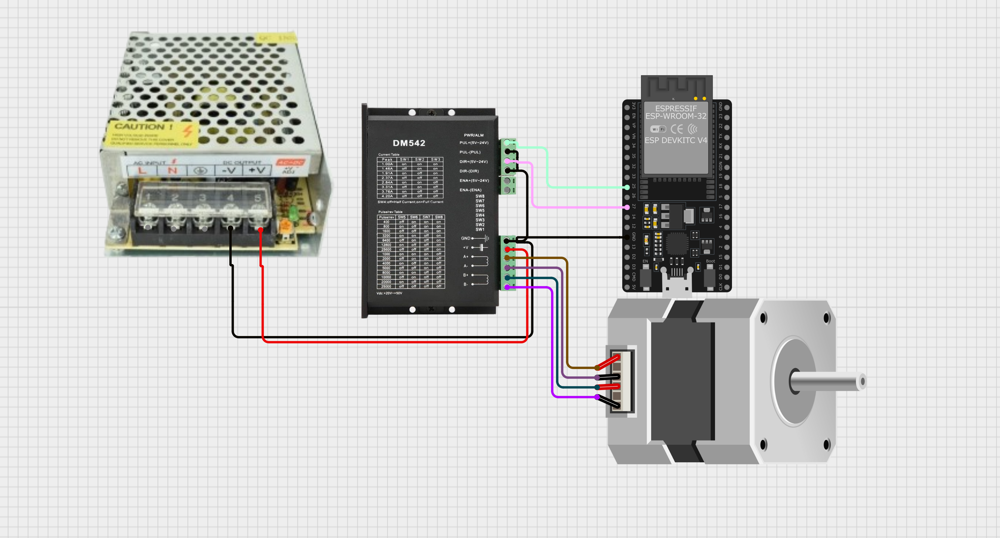

Driver Industrial DM542T
========================

Arquitectura interna del DM542T
----------------------------------

El DM542T es un **driver digital de lazo abierto** para motores paso a paso bipolares.

Internamente contiene:

- Etapa de potencia con **puentes H** para dos bobinas (A y B)
- Control digital de corriente (PWM + control senoidal)
- Optoacopladores en entradas de control
- Lógica de conteo de pulsos STEP/DIR
- Protecciones internas:
  - Sobrecorriente
  - Sobretemperatura
  - Subtensión

El driver **NO conoce grados ni posiciones absolutas**.
Solo interpreta:
- Pulsos
- Sentido
- Corriente configurada

Entradas y salidas del DM542T
~~~~~~~~~~~~~~~~~~~~~~~~~~~~~

La bornera del DM542T se divide en:
- **Entradas de control (señales)**
- **Salidas de potencia (motor)**
- **Alimentación**
- **Salida de estado/alarma**

1. Entradas de control: PUL (STEP)

Terminales:
- **PUL+**
- **PUL-**

*Función eléctrica*

- Entrada a un **optoacoplador**
- Cada transición activa del opto genera **un incremento interno de contador**

*Función lógica*
- **Cada pulso STEP = un micro-paso**
- El tamaño del paso depende del microstepping configurado (SW5–SW8)

*Qué ocurre internamente*
- El driver incrementa o decrementa el contador de posición interna
- Actualiza las corrientes en las bobinas según la tabla senoidal

*Requisitos eléctricos*
- Pulso mínimo típico: **≥ 2.5 µs**
- Recomendado: **5 µs o más**
- Frecuencia máxima típica: **200 kHz** (práctico mucho menor)

*En tu conexión con ESP32*
Modo recomendado (prueba directa):

::
   PUL- -> GND ESP32
   PUL+ -> GPIO STEP

*Qué pasa si no se conecta*
- El motor **no se mueve**
- El driver queda energizado pero sin comandos

2. Entradas de control: DIR (dirección)

Terminales:
- **DIR+**
- **DIR-**

*Función eléctrica*
- Entrada optoacoplada
- Nivel lógico estable (no pulso)

*Función lógica*

- Define el **sentido de conteo** del contador interno:
  - HIGH → sentido A
  - LOW  → sentido B

*Cuándo se lee DIR*
- El estado de DIR se muestrea **antes del flanco activo del pulso STEP**

*En la práctica*
- Cambia DIR
- Espera unos microsegundos
- Envía pulsos STEP

*En tu conexión con ESP32*

::
   DIR- -> GND ESP32
   DIR+ -> GPIO DIR

*Qué pasa si no se conecta*
- El sentido queda indeterminado
- Puede girar siempre en un solo sentido

3. Entradas de control: ENA (Enable)

Terminales:
- **ENA+**
- **ENA-**

*Función eléctrica*
- Entrada optoacoplada
- Controla la **habilitación de la etapa de potencia**

*Función lógica*

- Enable activo:
  - Driver energiza bobinas
  - Mantiene torque

- Enable inactivo:
  - Driver desenergiza bobinas
  - Motor queda libre

*Uso típico*
- Seguridad
- Parada de emergencia
- Ahorro de energía

*Importante*
- Algunos drivers consideran ENA activo en HIGH
- Otros en LOW
- Depende del cableado (common anode / common cathode)

*En la conexión con ESP32*

::
   ENA- -> GND ESP32
   ENA+ -> GPIO EN   (opcional)

*Si NO se usa*
- Puede dejarse sin conectar
- O fijarse siempre habilitado

4. Salida de estado: ALM (Alarm)

Terminales:
- **ALM+**
- **ALM-**

*Función eléctrica*
- Salida optoacoplada (colector abierto)

*Función lógica*

- Indica condición de fallo:
  - Sobrecorriente
  - Sobretemperatura
  - Error interno

*Uso típico*
- Encender LED de fallo
- Entrada a PLC o microcontrolador
- Activar relé de seguridad

*En tu sistema*
- **No es necesaria para pruebas iniciales**
- Puede conectarse luego a una entrada GPIO

5. Salidas de potencia: Motor

Terminales:
- **A+ / A-**
- **B+ / B-**

*Función*
- Alimentan las dos bobinas del motor paso a paso bipolar

*Importante*
- A y B deben ser **pares reales de bobina**

- Si se cruzan:
  - El motor vibra
  - No gira correctamente

*Identificación de bobinas*
- Medir continuidad con multímetro
- Cada bobina tiene baja resistencia (≈1–2 Ω)

6. Alimentación del driver

Terminales:
- **+Vdc**
- **GND**

*Función*
- Alimenta la etapa de potencia y control del driver

*Valores permitidos*
- Típico: **20–50 V DC**
- Recomendado para tu caso: **24 V DC**

*Importante*
- **NO es la alimentación lógica**
- **NO conectar 5 V aquí**

Motor: NEMA23 con reductora
---------------------------

Modelo: **23HS22-2804S-PG47**

- Motor paso a paso típico: **1.8° por paso** (200 pasos por vuelta del eje del motor).
- Reductora: **PG47** (aprox. **47:1**).
- La reductora incrementa el torque disponible en la salida y reduce la velocidad.
- La reductora también introduce **backlash (juego mecánico)**, por lo que la precisión final depende más de la mecánica que del microstepping alto.

Diagrama de conexión
--------------------

   Imagen

1. Alimentación 24V al DM542T

Conectar la fuente **24V DC** al driver:

::

   Fuente 24V (+)  ->  +Vdc  (DM542T)
   Fuente 24V (-)  ->  GND   (DM542T)

2. Conexión del motor (bobinas)

Conectar las bobinas del motor a los bornes del driver:

::

   A+  A-   (Bobina A)
   B+  B-   (Bobina B)

.. tip::

   Si el motor vibra pero no gira, es probable que las bobinas estén cruzadas.
   Identifica pares de bobina con multímetro (continuidad/resistencia) y conecta cada par a A y B.

3. Señales STEP/DIR/ENA (modo "common-cathode")

Para una prueba directa desde la ESP32, se recomienda usar un común a tierra en los terminales negativos:

Conectar a GND común:

::

   DM542T PUL-  -> GND ESP32
   DM542T DIR-  -> GND ESP32
   DM542T ENA-  -> GND ESP32   (opcional)

Conectar señales desde la ESP32:

::

   ESP32 GPIO_STEP -> DM542T PUL+
   ESP32 GPIO_DIR  -> DM542T DIR+
   ESP32 GPIO_EN   -> DM542T ENA+ (opcional)

Pines sugeridos (pueden cambiarse):

::

   STEP = GPIO 25
   DIR  = GPIO 26
   EN   = GPIO 27

.. warning::

   Si el driver no detecta correctamente el 3.3V del ESP32 (optoacoplador requiere más corriente/voltaje),
   será necesario usar adaptación (NPN o ULN). Esta guía inicia con prueba directa.

Configuración recomendada
-------------------------

Configurar el driver para que **Pulse/rev = 400**:

- **SW5 = OFF**
- **SW6 = ON**
- **SW7 = ON**
- **SW8 = ON**

Microstepping
~~~~~~~~~~~~~

1. Paso real vs resolución de comando

- El motor tiene **posiciones estables** determinadas por su geometría: para 1.8°:
  - **200 pasos por vuelta** del eje del motor.
- El **microstepping** no cambia la geometría del motor; el driver:
  - Interpola corrientes entre bobinas para posicionar el rotor *entre* pasos.
  - Mejora suavidad, reduce vibración/ruido.
  - Reduce el torque por micro-paso (posición intermedia es menos rígida).

2. ¿Por qué existen microsteppings altos (hasta 25600)?

- Para suavidad extrema y reducción de resonancia, especialmente en aplicaciones CNC/ópticas.
- Para compatibilidad con controladores/PLCs que trabajan con resoluciones específicas.
- Contras principales:
  - Menor torque incremental por micro-paso.
  - Menor velocidad máxima por aumento de pulsos requeridos.
  - No mejora la precisión final si existe backlash/flexión mecánica.

.. important::

   En sistemas con reductora (como PG47), normalmente basta con **200 o 400 pulse/rev** para excelente desempeño.

Corriente del motor (SW1–SW3)
~~~~~~~~~~~~~~~~~~~~~~~~~~~~~

El motor indicado suele ser alrededor de **2.8A RMS** nominal.
Una configuración segura y práctica es ajustar cerca pero ligeramente por debajo (reduce calentamiento y protege el sistema).

Configuración sugerida:

- **SW1 = ON**
- **SW2 = OFF**
- **SW3 = OFF**

Reducción de corriente en reposo (SW4)

- **SW4 = OFF** (Half Current en reposo)
  - Menos calentamiento mientras el motor está detenido.
  - Recomendado para pruebas y uso general.

Resumen final de switches

::

   SW1 ON
   SW2 OFF
   SW3 OFF
   SW4 OFF
   SW5 OFF
   SW6 ON
   SW7 ON
   SW8 ON

Ecuaciones
------------------------

1. Pasos por vuelta del motor (1.8°)

Ángulo por paso:

.. math::

   \theta_{paso} = 1.8^\circ

Pasos por vuelta del motor:

.. math::

   N_{motor} = \frac{360^\circ}{\theta_{paso}} = \frac{360}{1.8} = 200

2. Pulsos por vuelta del motor con microstepping

Sea:

- :math:`M` = factor de microstepping (full step: 1, half: 2, quarter: 4, etc.)

Entonces:

.. math::

   N_{pulsos\_motor} = N_{motor} \times M

Para **400 pulse/rev**:

.. math::

   M = 2 \Rightarrow N_{pulsos\_motor} = 200 \times 2 = 400

3. Pulsos por vuelta en la salida con reductora PG47

Sea:

- :math:`R = 47` relación de reducción.

Entonces:

.. math::

   N_{salida} = N_{pulsos\_motor} \times R

Con 400 pulse/rev motor:

.. math::

   N_{salida} = 400 \times 47 = 18800

4. Resolución angular de comando en la salida

.. math::

   \theta_{res\_salida} = \frac{360^\circ}{N_{salida}}

Para el caso:

.. math::

   \theta_{res\_salida} = \frac{360}{18800} \approx 0.019^\circ

5. Conversión: grados → pulsos (salida)

.. math::

   P = \frac{\theta}{360^\circ} \times N_{salida}

Ejemplo 90°:

.. math::

   P = \frac{90}{360} \times 18800 = 4700

6. Conversión: pulsos → grados (salida)

.. math::

   \theta = \frac{P}{N_{salida}} \times 360^\circ

7. Velocidad: frecuencia de pulso → RPM de salida

Sea:

- :math:`f_{step}` frecuencia de pulsos STEP (Hz = pulsos/seg)

Entonces:

.. math::

   RPM_{salida} = \frac{f_{step}}{N_{salida}} \times 60

Ejemplo con 2000 Hz:

.. math::

   RPM_{salida} = \frac{2000}{18800}\times 60 \approx 6.38

8. Relación RMS y pico del driver (referencia)

.. math::

   I_{peak} \approx I_{RMS}\times 1.4

Código ESP32 (AccelStepper) para 400 pulse/rev
-------------------------------------------------

Requisitos:

- Arduino IDE
- Placa ESP32 con **core 3.x**
- Librería **AccelStepper**

El siguiente ejemplo:

- Asume el DM542T configurado a **400 pulse/rev** del motor.
- Calcula pulsos por vuelta de salida con :math:`R=47`.
- Mueve +90° y vuelve a 0° usando aceleración.

.. code-block:: cpp

   #include <Arduino.h>
   #include <AccelStepper.h>

   // --------------------
   // Pines ESP32
   // --------------------
   static const int PIN_STEP = 25;  // -> PUL+
   static const int PIN_DIR  = 26;  // -> DIR+
   static const int PIN_EN   = 27;  // -> ENA+ (opcional)

   // --------------------
   // Configuración: 400 pulse/rev del motor (por DIP SW5..SW8)
   // Reductora: PG47 ~ 47:1
   // --------------------
   static const long PULSES_PER_REV_MOTOR = 400;
   static const float GEAR_RATIO = 47.0f;

   // Pulsos por vuelta del eje de salida (aprox)
   static const long PULSES_PER_REV_OUT = (long)(PULSES_PER_REV_MOTOR * GEAR_RATIO + 0.5f);

   // Driver en modo STEP/DIR
   AccelStepper stepper(AccelStepper::DRIVER, PIN_STEP, PIN_DIR);

   // Convierte grados del eje de salida a pulsos
   long outDegreesToPulses(float deg_out) {
     float pulses = (deg_out / 360.0f) * (float)PULSES_PER_REV_OUT;
     return lroundf(pulses);
   }

   void setup() {
     Serial.begin(115200);

     pinMode(PIN_EN, OUTPUT);

     // ENA: según el cableado del enable del driver, puede requerir invertir
     // Para esta prueba, iniciamos habilitado en HIGH.
     digitalWrite(PIN_EN, HIGH);

     // Ajustes AccelStepper
     stepper.setMaxSpeed(2000);       // pulsos/seg
     stepper.setAcceleration(1500);   // pulsos/seg^2
     stepper.setMinPulseWidth(5);     // us (pulso seguro)

     stepper.setCurrentPosition(0);

     Serial.println("DM542T + ESP32 listo (400 pulse/rev motor).");
     Serial.print("Pulsos/vuelta salida aprox: ");
     Serial.println(PULSES_PER_REV_OUT);
   }

   void loop() {
     long p90 = outDegreesToPulses(90.0f);

     Serial.println("Moviendo +90° (salida)...");
     stepper.moveTo(p90);
     while (stepper.distanceToGo() != 0) {
       stepper.run();
     }
     delay(500);

     Serial.println("Volviendo a 0° (salida)...");
     stepper.moveTo(0);
     while (stepper.distanceToGo() != 0) {
       stepper.run();
     }
     delay(1000);
   }

Diagnóstico rápido
------------------

- Si el motor no se mueve:
  - Confirma **24V** en +Vdc/GND.
  - Confirma **GND común** entre ESP32 y DM542T (PUL-/DIR-/ENA- a GND ESP32).
  
  - Prueba invertir enable:
    - cambiar ``digitalWrite(PIN_EN, HIGH);`` por ``digitalWrite(PIN_EN, LOW);``
  
  - Reduce velocidad:
    - ``setMaxSpeed(800);`` y ``setAcceleration(400);``

- Si vibra pero no gira:
  - Verifica pares de bobina y conexión A/B.

- Si responde de forma intermitente:
  - El 3.3V puede ser insuficiente para el opto; usar etapa NPN/ULN.

