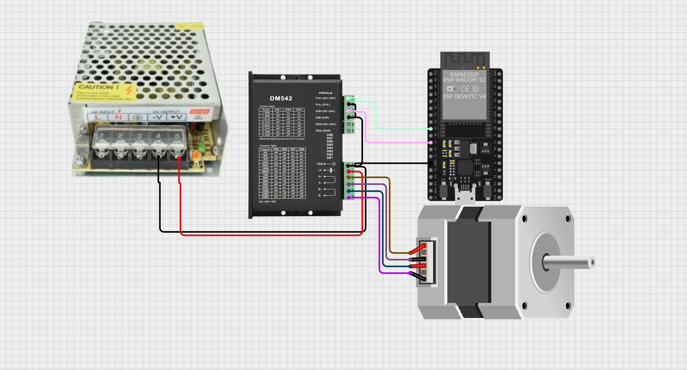

Drivers para Steppers 
======================

Driver A4988 - Nema 17
----------------------

Control de Motor Paso a Paso NEMA 17 con ESP32 y A4988
~~~~~~~~~~~~~~~~~~~~~~~~~~~~~~~~~~~~~~~~~~~~~~~~~~~~~~

1. Especificaciones Generales

**¿Qué es un paso?**

- Un motor NEMA 17 típico tiene **200 pasos por vuelta**, es decir: (
  1.8° ) por paso en modo paso completo.
- En microstepping, se subdividen los pasos para mayor precisión.

============= ================ ===============
Microstepping Pasos por vuelta Ángulo por paso
============= ================ ===============
Paso completo 200              1.8°
Medio paso    400              0.9°
1/4 paso      800              0.45°
1/8 paso      1600             0.225°
1/16 paso     3200             0.1125°
============= ================ ===============

2. Configuración de MS1, MS2, MS3 en A4988

============= ==== ==== ====
Resolución    MS1  MS2  MS3
============= ==== ==== ====
Paso completo LOW  LOW  LOW
Medio paso    HIGH LOW  LOW
1/4 paso      LOW  HIGH LOW
1/8 paso      HIGH HIGH LOW
1/16 paso     HIGH HIGH HIGH
============= ==== ==== ====

3. Circuito ESP32 - Motores a paso Nema 17 ESP32 - 38 pines |alt text|
   Circuito |image1|

--------------

4. Alimentación del driver A4988 y Vref

**¿Cómo ajustar el Vref?** 

- Para un NEMA 17 de 1.2 A y Rs = 0.1 Ω:

Si se usa una configuracion a medio paso es recomendado disminuir el
límite de voltaje al 70%.

4. Control por ESP32 - Código Base (medio paso)

.. code:: cpp

   #define STEP_PIN 18
   #define DIR_PIN 19

   void setup() {
     pinMode(STEP_PIN, OUTPUT);
     pinMode(DIR_PIN, OUTPUT);
     digitalWrite(DIR_PIN, HIGH); // Sentido
   }

   void loop() {
     for (int i = 0; i < 400; i++) {
       digitalWrite(STEP_PIN, HIGH);
       delayMicroseconds(1000);
       digitalWrite(STEP_PIN, LOW);
       delayMicroseconds(1000);
     }
     delay(2000);
   }

Control de Motores Paso a Paso con ``AccelStepper`` y ESP32
~~~~~~~~~~~~~~~~~~~~~~~~~~~~~~~~~~~~~~~~~~~~~~~~~~~~~~~~~~~

**¿Qué es AccelStepper?**

``AccelStepper`` es una librería avanzada para controlar motores paso a
paso de forma más eficiente y profesional. Fue creada para reemplazar el
control básico con ``digitalWrite`` + ``delay()`` con una interfaz más
robusta y no bloqueante.

**Ventajas principales**

- Movimiento **suave** con **aceleración y desaceleración**
- Control **no bloqueante** con ``.run()``
- Soporta **múltiples motores simultáneos**
- Compatible con distintos tipos de driver (por ejemplo, A4988)

--------------

**Parámetros clave**

+-------------------------------+-----------------------------------------------+
| Método                        | Propósito                                     |
+===============================+===============================================+
| ``setMaxSpeed(pasos_s)``      | Establece la velocidad máxima del motor       |
|                               | (pasos/seg)                                   |
+-------------------------------+-----------------------------------------------+
| ``setAcceleration(pasos_s2)`` | Establece la aceleración (pasos/seg²)         |
+-------------------------------+-----------------------------------------------+
| ``move(pasos)``               | Fija un destino relativo en pasos             |
+-------------------------------+-----------------------------------------------+
| ``moveTo(pasos)``             | Fija un destino absoluto en pasos             |
+-------------------------------+-----------------------------------------------+
| ``run()``                     | Ejecuta el movimiento hacia el destino        |
|                               | suavemente                                    |
+-------------------------------+-----------------------------------------------+
| ``isRunning()``               | Devuelve true si el motor sigue en movimiento |
+-------------------------------+-----------------------------------------------+
| ``setCurrentPosition(p)``     | Cambia la posición actual sin mover           |
+-------------------------------+-----------------------------------------------+

Codigo de la ESP32:

.. code:: cpp

   #include <AccelStepper.h>
   #define STEP_PIN 18
   #define DIR_PIN 19

   // Modo DRIVER usa 1 pulso por paso (la lógica del driver define el microstepping)
   AccelStepper stepper(AccelStepper::DRIVER, STEP_PIN, DIR_PIN);

   void setup() {
     Serial.begin(115200);
     delay(1000);
     
     // Configura velocidad y aceleración
     stepper.setMaxSpeed(800);       // pasos por segundo (ajusta según tu driver)
     stepper.setAcceleration(200);   // pasos por segundo^2

     // mov(pasos) movimiento relativo
     // movTo(pasos) movimiento absoluto
     // Función para el Home del robot
   }

   void loop() {
     stepper.moveTo(0);          
     stepper.runToPosition();
     delay(4000);
     // Media Vuelta en sentido horario
     stepper.move(200);
     stepper.runToPosition();
     delay(1000);
     // Media Vuelta en sentido antihorario
     stepper.move(-200);
     stepper.runToPosition();
     delay(1000);
   }

.. |alt text| image:: image-1.png
.. |image1| image:: circuit_image-1.png

Driver DM542T y NEMA23 PG47
---------------------------

Arquitectura interna del DM542T 
~~~~~~~~~~~~~~~~~~~~~~~~~~~~~~~

El DM542T es un **driver digital de lazo abierto** para motores paso a paso bipolares.

Internamente contiene:

- Etapa de potencia con **puentes H** para dos bobinas (A y B)
- Control digital de corriente (PWM + control senoidal)
- Optoacopladores en entradas de control
- Lógica de conteo de pulsos STEP/DIR
- Protecciones internas:

  - Sobrecorriente
  - Sobretemperatura
  - Subtensión

El driver permite configurar:

- Pulsos
- Sentido
- Corriente configurada

**Entradas y salidas del DM542T**

La bornera del DM542T se divide en:

- Entradas de control (señales)
- Salidas de potencia (motor)
- Alimentación
- Salida de estado/alarma

.. list-table::
   :header-rows: 1
   :widths: 10 15 15 15 
   :class: fit-table

   * - Terminales
     - Función Eléctrica
     - Función Lógica
     - Comportamiento
   * - PUL+ PUL- 
     - Entrada a un octoacoplador, Cada transición activa del opto genera un incremento interno de contador.
     - Cada pulso STEP = un micro-paso, El tamaño del paso depende del microstepping configurado (SW5–SW8)
     - El driver incrementa o decrementa el contador de posición interna y Actualiza las corrientes en las bobinas según la tabla senoidal
   * - DIR+ DIR-
     - Entrada optoacoplada y Nivel lógico estable
     - Define el sentido de conteo del contador interno: HIGH → sentido A, LOW  → sentido B *Cuándo se lee DIR*. El estado de DIR se muestrea **antes del flanco activo del pulso STEP**
     - Cambia DIR, espera unos microsegundos y envía pulsos STEP
   * - ENA+ ENA-
     - Entrada optoacoplada que controla la habilitación de la etapa de potencia
     - **Enable activo:** Driver energiza bobinas Mantiene torque. **Enable inactivo:** Driver desenergiza bobinas y motor queda libre
     - Permite aumentar el nivel de seguridal al crear paradas de emergencia, y ahorro de energía.
   * - ALM+ ALM- 
     - Salida optoacoplada (colector abierto)
     - Indica condición de fallo: Sobrecorrient, sobretemperatura, rror interno
     - Permite activar actuadores de seguridad (LEDS, Alarmas, entre otros).
   * - A+/A- B+/B-
     - Alimentan las dos bobinas del motor paso a paso bipolar.
     - A y B deben ser **pares reales de bobina**
     - Si se cruzan: El motor vibra o No gira correctamente, por lo cual, es importante *Identificación de bobinas* 
   * - VDC GND
     - Alimenta la etapa de potencia y control del driver 
     - Alimentación de 18 - 50 [v] DC
     - No conectar alimentación de 5[v]

*Requisitos eléctricos*
- Pulso mínimo típico: **≥ 2.5 µs**
- Recomendado: **5 µs o más**
- Frecuencia máxima típica: **200 kHz** (práctico mucho menor)

**Microstepping**

1. Paso real vs resolución de comando

- El motor tiene posiciones estables determinadas por su geometría: para 1.8°: 200 pasos por vuelta del eje del motor.
- El microstepping no cambia la geometría del motor; el driver:

  - Interpola corrientes entre bobinas para posicionar el rotor *entre* pasos.
  - Mejora suavidad, reduce vibración/ruido.
  - Reduce el torque por micro-paso (posición intermedia es menos rígida).

2. ¿Por qué existen microsteppings altos (hasta 25600)?

- Para suavidad extrema y reducción de resonancia, especialmente en aplicaciones CNC/ópticas.
- Para compatibilidad con controladores/PLCs que trabajan con resoluciones específicas.
- Contras principales:

  - Menor torque incremental por micro-paso.
  - Menor velocidad máxima por aumento de pulsos requeridos.
  - No mejora la precisión final si existe backlash/flexión mecánica.

.. important::

   En sistemas con reductora (como PG47), normalmente basta con **200 o 400 pulse/rev** para excelente desempeño.

Motor: NEMA23 con reductora
~~~~~~~~~~~~~~~~~~~~~~~~~~~

Modelo: 23HS22-2804S-PG47

- Motor paso a paso típico: 1.8° por paso (200 pasos por vuelta del eje del motor).
- Reductora: PG47 (aprox. 47:1).
- La reductora incrementa el torque disponible en la salida y reduce la velocidad.
- La reductora también introduce backlash (juego mecánico), por lo que la precisión final depende más de la mecánica que del microstepping alto.

Diagrama de conexión
~~~~~~~~~~~~~~~~~~~~

   Imagen

1. Conexiones

::

   Fuente 24V (+)  ->  +Vdc  (DM542T)
   Fuente 24V (-)  ->  GND   (DM542T)
   A+  A-   (Bobina A)
   B+  B-   (Bobina B)
   DM542T PUL-  -> GND ESP32
   DM542T DIR-  -> GND ESP32
   DM542T ENA-  -> GND ESP32   (opcional)
   ESP32 GPIO_STEP -> DM542T PUL+
   ESP32 GPIO_DIR  -> DM542T DIR+
   ESP32 GPIO_EN   -> DM542T ENA+ (opcional)

2. Configurar el driver para que **Pulse/rev = 400**:

::

   SW5 = OFF
   SW6 = ON
   SW7 = ON
   SW8 = ON

**Corriente del motor (SW1–SW3)**

El motor indicado suele ser alrededor de **2.8A RMS** nominal.
Una configuración segura y práctica es ajustar cerca pero ligeramente por debajo (reduce calentamiento y protege el sistema).

Configuración sugerida:

::

   SW1 = ON
   SW2 = OFF
   SW3 = OFF

Reducción de corriente en reposo (SW4)

- SW4 = OFF (Half Current en reposo)

  - Menos calentamiento mientras el motor está detenido.
  - Recomendado para pruebas y uso general.

Ecuaciones
~~~~~~~~~~

1. Pasos por vuelta del motor (1.8°)

Ángulo por paso:

.. math::

   \theta_{paso} = 1.8^\circ

Pasos por vuelta del motor:

.. math::

   N_{motor} = \frac{360^\circ}{\theta_{paso}} = \frac{360}{1.8} = 200

2. Pulsos por vuelta del motor con microstepping

Sea:

- :math:`M` = factor de microstepping (full step: 1, half: 2, quarter: 4, etc.)

Entonces:

.. math::

   N_{pulsos\_motor} = N_{motor} \times M

Para **400 pulse/rev**:

.. math::

   M = 2 \Rightarrow N_{pulsos\_motor} = 200 \times 2 = 400

3. Pulsos por vuelta en la salida con reductora PG47

Sea:

- :math:`R = 47` relación de reducción.

Entonces:

.. math::

   N_{salida} = N_{pulsos\_motor} \times R

Con 400 pulse/rev motor:

.. math::

   N_{salida} = 400 \times 47 = 18800

4. Resolución angular de comando en la salida

.. math::

   \theta_{res\_salida} = \frac{360^\circ}{N_{salida}}

Para el caso:

.. math::

   \theta_{res\_salida} = \frac{360}{18800} \approx 0.019^\circ

5. Conversión: grados → pulsos (salida)

.. math::

   P = \frac{\theta}{360^\circ} \times N_{salida}

Ejemplo 90°:

.. math::

   P = \frac{90}{360} \times 18800 = 4700

6. Conversión: pulsos → grados (salida)

.. math::

   \theta = \frac{P}{N_{salida}} \times 360^\circ

7. Velocidad: frecuencia de pulso → RPM de salida

Sea:

- :math:`f_{step}` frecuencia de pulsos STEP (Hz = pulsos/seg)

Entonces:

.. math::

   RPM_{salida} = \frac{f_{step}}{N_{salida}} \times 60

Ejemplo con 2000 Hz:

.. math::

   RPM_{salida} = \frac{2000}{18800}\times 60 \approx 6.38

8. Relación RMS y pico del driver (referencia)

.. math::

   I_{peak} \approx I_{RMS}\times 1.4

Código ESP32 (AccelStepper) para 400 pulse/rev
~~~~~~~~~~~~~~~~~~~~~~~~~~~~~~~~~~~~~~~~~~~~~~

Requisitos:

- Arduino IDE
- Placa ESP32 con **core 3.x**
- Librería **AccelStepper**

El siguiente ejemplo:

- Asume el DM542T configurado a **400 pulse/rev** del motor.
- Calcula pulsos por vuelta de salida con :math:`R=47`.
- Mueve +90° y vuelve a 0° usando aceleración.

.. code-block:: cpp

   #include <Arduino.h>
   #include <AccelStepper.h>

   // --------------------
   // Pines ESP32
   // --------------------
   static const int PIN_STEP = 25;  // -> PUL+
   static const int PIN_DIR  = 26;  // -> DIR+
   static const int PIN_EN   = 27;  // -> ENA+ (opcional)

   // --------------------
   // Configuración: 400 pulse/rev del motor (por DIP SW5..SW8)
   // Reductora: PG47 ~ 47:1
   // --------------------
   static const long PULSES_PER_REV_MOTOR = 400;
   static const float GEAR_RATIO = 47.0f;

   // Pulsos por vuelta del eje de salida (aprox)
   static const long PULSES_PER_REV_OUT = (long)(PULSES_PER_REV_MOTOR * GEAR_RATIO + 0.5f);

   // Driver en modo STEP/DIR
   AccelStepper stepper(AccelStepper::DRIVER, PIN_STEP, PIN_DIR);

   // Convierte grados del eje de salida a pulsos
   long outDegreesToPulses(float deg_out) {
     float pulses = (deg_out / 360.0f) * (float)PULSES_PER_REV_OUT;
     return lroundf(pulses);
   }

   void setup() {
     Serial.begin(115200);

     pinMode(PIN_EN, OUTPUT);

     // ENA: según el cableado del enable del driver, puede requerir invertir
     // Para esta prueba, iniciamos habilitado en HIGH.
     digitalWrite(PIN_EN, HIGH);

     // Ajustes AccelStepper
     stepper.setMaxSpeed(2000);       // pulsos/seg
     stepper.setAcceleration(1500);   // pulsos/seg^2
     stepper.setMinPulseWidth(5);     // us (pulso seguro)

     stepper.setCurrentPosition(0);

     Serial.println("DM542T + ESP32 listo (400 pulse/rev motor).");
     Serial.print("Pulsos/vuelta salida aprox: ");
     Serial.println(PULSES_PER_REV_OUT);
   }

   void loop() {
     long p90 = outDegreesToPulses(90.0f);

     Serial.println("Moviendo +90° (salida)...");
     stepper.moveTo(p90);
     while (stepper.distanceToGo() != 0) {
       stepper.run();
     }
     delay(500);

     Serial.println("Volviendo a 0° (salida)...");
     stepper.moveTo(0);
     while (stepper.distanceToGo() != 0) {
       stepper.run();
     }
     delay(1000);
   }
