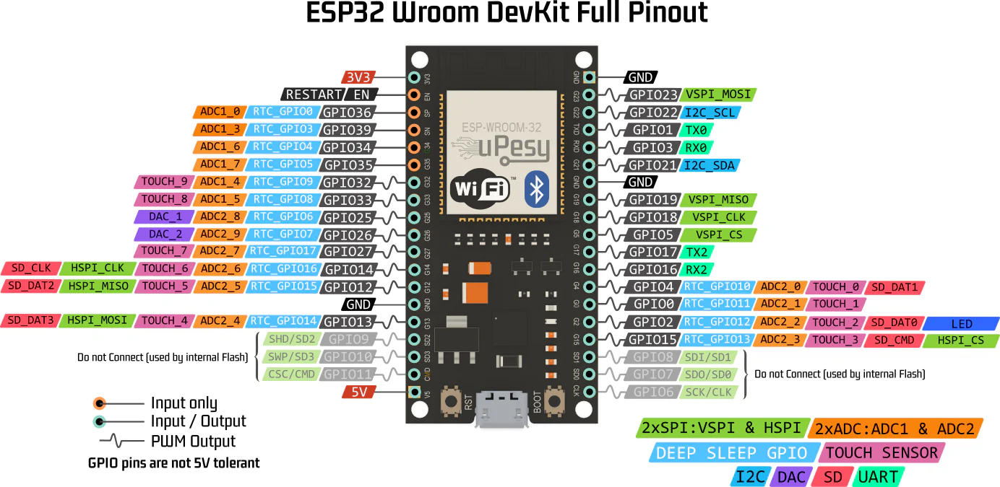
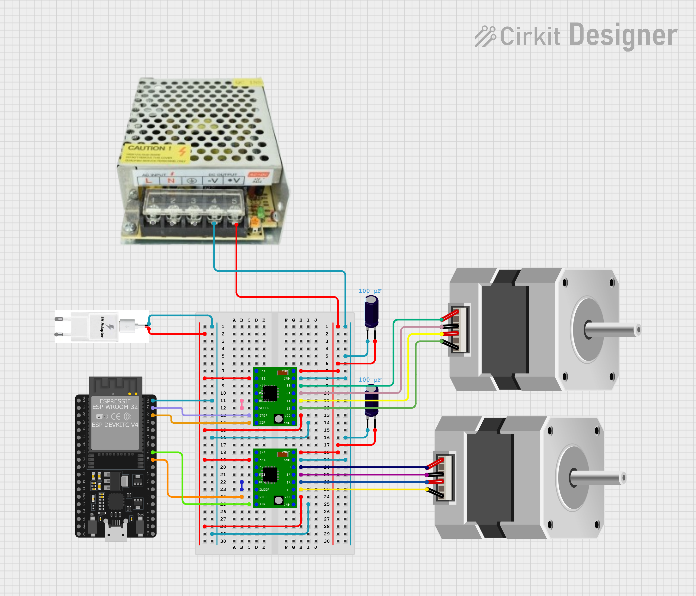

Gemelo Digital
==============

Para trabajara en el gemelo difital se plantea el uso de una ESP32 para el control de motores a paso Nema 17 y el archivo URDF del robot generado previamente.

URFD y ESP32
------------

Control de Motor Paso a Paso NEMA 17 con ESP32 y A4988
~~~~~~~~~~~~~~~~~~~~~~~~~~~~~~~~~~~~~~~~~~~~~~~~~~~~~~

1. Especificaciones Generales

**¿Qué es un paso?**

- Un motor NEMA 17 típico tiene **200 pasos por vuelta**, es decir: (
  1.8° ) por paso en modo paso completo.
- En microstepping, se subdividen los pasos para mayor precisión.

============= ================ ===============
Microstepping Pasos por vuelta Ángulo por paso
============= ================ ===============
Paso completo 200              1.8°
Medio paso    400              0.9°
1/4 paso      800              0.45°
1/8 paso      1600             0.225°
1/16 paso     3200             0.1125°
============= ================ ===============

--------------

2. Configuración de MS1, MS2, MS3 en A4988

============= ==== ==== ====
Resolución    MS1  MS2  MS3
============= ==== ==== ====
Paso completo LOW  LOW  LOW
Medio paso    HIGH LOW  LOW
1/4 paso      LOW  HIGH LOW
1/8 paso      HIGH HIGH LOW
1/16 paso     HIGH HIGH HIGH
============= ==== ==== ====

3. Circuito ESP32 - Motores a paso Nema 17 ESP32 - 38 pines |alt text|
   Circuito |image1|

--------------

4. Alimentación del driver A4988 y Vref

**¿Cómo ajustar el Vref?** 


- Para un NEMA 17 de 1.2 A y Rs = 0.1 Ω:


Si se usa una configuracion a medio paso es recomendado disminuir el
límite de voltaje al 70%.

4. Control por ESP32 - Código Base (medio paso)

.. code:: cpp

   #define STEP_PIN 18
   #define DIR_PIN 19

   void setup() {
     pinMode(STEP_PIN, OUTPUT);
     pinMode(DIR_PIN, OUTPUT);
     digitalWrite(DIR_PIN, HIGH); // Sentido
   }

   void loop() {
     for (int i = 0; i < 400; i++) {
       digitalWrite(STEP_PIN, HIGH);
       delayMicroseconds(1000);
       digitalWrite(STEP_PIN, LOW);
       delayMicroseconds(1000);
     }
     delay(2000);
   }

Control de Motores Paso a Paso con ``AccelStepper`` y ESP32
~~~~~~~~~~~~~~~~~~~~~~~~~~~~~~~~~~~~~~~~~~~~~~~~~~~~~~~~~~~

**¿Qué es AccelStepper?**

``AccelStepper`` es una librería avanzada para controlar motores paso a
paso de forma más eficiente y profesional. Fue creada para reemplazar el
control básico con ``digitalWrite`` + ``delay()`` con una interfaz más
robusta y no bloqueante.

**Ventajas principales**

- Movimiento **suave** con **aceleración y desaceleración**
- Control **no bloqueante** con ``.run()``
- Soporta **múltiples motores simultáneos**
- Compatible con distintos tipos de driver (por ejemplo, A4988)

--------------

**Parámetros clave**

+-------------------------------+-----------------------------------------------+
| Método                        | Propósito                                     |
+===============================+===============================================+
| ``setMaxSpeed(pasos_s)``      | Establece la velocidad máxima del motor       |
|                               | (pasos/seg)                                   |
+-------------------------------+-----------------------------------------------+
| ``setAcceleration(pasos_s2)`` | Establece la aceleración (pasos/seg²)         |
+-------------------------------+-----------------------------------------------+
| ``move(pasos)``               | Fija un destino relativo en pasos             |
+-------------------------------+-----------------------------------------------+
| ``moveTo(pasos)``             | Fija un destino absoluto en pasos             |
+-------------------------------+-----------------------------------------------+
| ``run()``                     | Ejecuta el movimiento hacia el destino        |
|                               | suavemente                                    |
+-------------------------------+-----------------------------------------------+
| ``isRunning()``               | Devuelve true si el motor sigue en movimiento |
+-------------------------------+-----------------------------------------------+
| ``setCurrentPosition(p)``     | Cambia la posición actual sin mover           |
+-------------------------------+-----------------------------------------------+

Codigo de la ESP32:

.. code:: cpp

   #include <AccelStepper.h>
   #define STEP_PIN 18
   #define DIR_PIN 19

   // Modo DRIVER usa 1 pulso por paso (la lógica del driver define el microstepping)
   AccelStepper stepper(AccelStepper::DRIVER, STEP_PIN, DIR_PIN);

   void setup() {
     Serial.begin(115200);
     delay(1000);
     
     // Configura velocidad y aceleración
     stepper.setMaxSpeed(800);       // pasos por segundo (ajusta según tu driver)
     stepper.setAcceleration(200);   // pasos por segundo^2

     // mov(pasos) movimiento relativo
     // movTo(pasos) movimiento absoluto
     // Función para el Home del robot
   }

   void loop() {
     stepper.moveTo(0);          
     stepper.runToPosition();
     delay(4000);
     // Media Vuelta en sentido horario
     stepper.move(200);
     stepper.runToPosition();
     delay(1000);
     // Media Vuelta en sentido antihorario
     stepper.move(-200);
     stepper.runToPosition();
     delay(1000);
   }




Control de Motores con MQTT
~~~~~~~~~~~~~~~~~~~~~~~~~~~~~~~~~~~~~~~~~~~~~~~~~~~~~~~~~~~

El control de los ángulos que deben girar los stepper se realiza a través del envío de un diccionario con las claves de las juntas usando MQTT y JSON.

El código se datalla a continuación:  

- ``control_stepper.py`` Envia un mensaje JSON con el delta del angulo que debe mover la junta *q1 o q2*.
- ``ESP32`` Recibe los mensajes y realiza el movimiento del stepper de cada junta de forma relativa.

.. tabs::

   .. group-tab:: python

      Dentro de la carpeta ``mqtt_python`` crear el archivo control_stepper.py

      .. code:: python

         import paho.mqtt.client as mqtt
         import json
         import time

         # Configuración del broker
         BROKER            = "192.168.100.178" # Ip del computador o localhost
         TOPIC_SUB_SEN     = "ra/sensores"
         TOPIC_SUB_EST     = "ra/estados"
         TOPIC_PUB         = "ra/juntas"
         CLIENT_ID         = "cliente_rm1"

         # Callback cuando se conecta al broker
         def on_connect(client, userdata, flags, rc, properties=None):
            if rc == 0:
               print("Conectado al broker MQTT")
               client.subscribe(TOPIC_SUB_SEN)
               client.subscribe(TOPIC_SUB_EST)

            else:
               print(f"Error de conexión: código {rc}")

         # Callback al recibir un mensaje
         def on_message(client, userdata, msg):
            try:
               mensaje = msg.payload.decode("utf-8")
               data = json.loads(mensaje)
               if msg.topic == TOPIC_SUB_SEN:
                     print("Mensaje recido del Equipo2 Ultrasónico:", data["ultra"])
               
               if msg.topic == TOPIC_SUB_EST:
                     print("Mensaje recido del Equipo2 Estado:", data["Estado"])

            except Exception as e:
               print("Error procesando mensaje:", e)

         client = mqtt.Client(client_id=CLIENT_ID, protocol=mqtt.MQTTv311)

         # Asociar funciones de callback
         client.on_connect = on_connect
         client.on_message = on_message

         # Conexión al broker
         client.connect(BROKER)

         # Iniciar loop en segundo plano
         client.loop_start()

         # Envío continuo de mensajes cada segundo
         try:
            while True:
               payload = {
                     "q1": 80,
                     "q2": 80,
                     "avanzar": 1
                     }
               mensaje = json.dumps(payload)
               client.publish(TOPIC_PUB, mensaje)
               #print("Publicado en datos_1:", payload)
               time.sleep(5)

         except KeyboardInterrupt:
            print("\n Finalizando conexión MQTT...")

         finally:
            client.loop_stop()
            client.disconnect()
            print(" Desconectado correctamente.")

   .. group-tab:: Esp32 MQTT

      Pestaña 1 del codigo de la ESP32.

      .. code:: cpp

         #include <PubSubClient.h>
         #include <WiFi.h>
         #include <ArduinoJson.h>

         #include <AccelStepper.h>

         // Pines motores paso a paso
         #define STEP1 18
         #define DIR1  19
         #define STEP2 22
         #define DIR2  23

         AccelStepper motor1(AccelStepper::DRIVER, STEP1, DIR1);  // Q1
         AccelStepper motor2(AccelStepper::DRIVER, STEP2, DIR2);  // Q2

         float gradosPorPaso = 0.9;

         // Variable de Control Alarmar
         int activar  = 0;
         int estado   = 0;
         int ultra    = 0;

         // GPIO de salidad Digital
         int pin_led   = 2;

         //  Credenciales Wifi 
         const char* ssid = "CARMEN GONZALEZ_";
         const char* password = "123wa321vg";

         // Credenciales MQTT
         const char* mqtt_broker = "192.168.100.178";
         const int mqtt_port     = 1883;
         const char* cliente     = "rm1_esp32";

         // Temas MQTT Publicar
         const char* tema_sub     = "ra/juntas";
         const char* tema_pub_est = "ra/estados";
         const char* tema_pub_sen = "ra/sensores";

         // Variables de control de tiempo
         unsigned long lastTime = 0;

         // Creacion del objeto cliente
         WiFiClient espClient;
         PubSubClient client(espClient);

         // Tamaño de mensaje JSON
         const size_t capacidad_json = JSON_OBJECT_SIZE(30);


         void setup() {
         // Setup Serial
         Serial.begin(115200);
         // Setup Wifi
         setup_wifi();
         // Setup MQTT
         conexion();
         // Manejo del rele
         pinMode(pin_led, OUTPUT);
         motor1.setMaxSpeed(200);     // Ajusta a tus necesidades
         motor1.setAcceleration(100); 
         motor1.setPinsInverted(true, false, false); // 
         motor2.setMaxSpeed(200);
         motor2.setAcceleration(100);
            
         }

         void loop() {
         Loop_MQTT();
         motor1.run();
         motor2.run();

         if (millis() - lastTime >= 100){
            estado = 1;
            ultra = ultra+1;
            envioDatos(tema_pub_est, estado, ultra);
            envioDatos(tema_pub_sen, estado, ultra);
            lastTime = millis();
         }
         if (activar == 1){
            digitalWrite(pin_led, HIGH);  // Enciende el LED
            
            }
         else {
            digitalWrite(pin_led, LOW);  // Enciende el LED
         }
         
         }


   .. group-tab:: conf_mqtt
   
      Pesataña 2 del codigo de la ESP32

      .. code:: cpp

         void setup_wifi() {
         // Conexión Wifi
         delay(10);
         Serial.println();
         Serial.print("Conectando a ");
         Serial.println(ssid);
         WiFi.begin(ssid, password);
         while (WiFi.status() != WL_CONNECTED) {
            delay(500);
            Serial.print(".");
         }
         Serial.println("");
         Serial.print("WiFi conectado - Dirección IP del ESP: ");
         Serial.println(WiFi.localIP());
         }

         void reconnect() {
         // Control de conexión MQTT
         while (!client.connected()) {
            Serial.print("Intentando conexión MQTT...");
            if (client.connect(cliente)) {
               Serial.println("Conectado");
               // Suscripción a TEMAS
               client.subscribe(tema_sub, 1);
            } else {
               Serial.print("Falló, rc=");
               Serial.print(client.state());
               Serial.println("Intentando de nuevo en 2 segundos");
               delay(2000);
            }
         }
         }

         void conexion() {
         // Conexión MQTT
         client.setServer(mqtt_broker, mqtt_port);
         client.setCallback(callback);
         }

         void Loop_MQTT() {
         // Manejo MQTT 
         if (!client.connected()) {
            reconnect();
         }
         client.loop();
         }

         void envioDatos(const char* mqtt_topic_publicar, int estado, int ultra) {
         DynamicJsonDocument mensaje(256);

         if (mqtt_topic_publicar == tema_pub_est) {
            mensaje["estado"]   = estado;
            String mensaje_json;
            serializeJson(mensaje, mensaje_json);
            client.publish(mqtt_topic_publicar, mensaje_json.c_str(), 1);
         }

         if (mqtt_topic_publicar == tema_pub_sen) {
            mensaje["ultra"]   = ultra;
            String mensaje_json;
            serializeJson(mensaje, mensaje_json);
            client.publish(mqtt_topic_publicar, mensaje_json.c_str(), 1);
         }
         
         
         }

         void callback(char* topic, byte* payload, unsigned int length) {
         StaticJsonDocument<capacidad_json> doc;
         char buffer[length + 1];
         memcpy(buffer, payload, length);
         buffer[length] = '\0';  // Asegura que el buffer tenga fin de cadena

         DeserializationError error = deserializeJson(doc, buffer);

         if (error) {
            Serial.print("Error al deserializar JSON: ");
            Serial.println(error.c_str());
            return;
         }

         String topico(topic);
         if (topico == "ra/juntas") {
            if (doc.containsKey("q1") && doc.containsKey("q2")) {
               float q1 = doc["q1"];
               float q2 = doc["q2"];

               int pasos1 = round(q1 / gradosPorPaso);
               int pasos2 = round(q2 / gradosPorPaso);

               motor1.move(pasos1);
               motor2.move(pasos2);

               Serial.print("Recibido q1: ");
               Serial.print(q1);
               Serial.print(" → pasos: ");
               Serial.println(pasos1);

               Serial.print("Recibido q2: ");
               Serial.print(q2);
               Serial.print(" → pasos: ");
               Serial.println(pasos2);
            }

            if (doc.containsKey("avanzar")) {
               activar = doc["avanzar"];
            }
         }
         }

ROS2 y el control de stepper
----------------------------

Con el fin de poder reflejar los movimientos del robot Simulado en RVIZ2 y del
robot real, se aplica la combinación de los códigos de ``mqtt_bridge`` y
``urdf_sub``.

Dentro de la carpeta ``mqtt_python``, crear el archivo ``urdf_mqtt```.

.. code:: python

   import rclpy
   from rclpy.node import Node
   from rclpy.duration import Duration
   from std_msgs.msg import Float32, Int32
   from sensor_msgs.msg import JointState

   import paho.mqtt.client as mqtt
   import json

   import math

   class MQTTBridge(Node): 
       def __init__(self):
           super().__init__('mqtt_bridge')

           # Angulos del robot
           self.real_q1 = 0.0
           self.real_q2 = 0.0
           self.real_q3 = 0.0

           self.pub = self.create_publisher( Float32, 'sensor_bateria', 1)
           self.subscription = self.create_subscription(
               JointState, 
               '/joint_states', 
               self.listener_ros, 1
               )

           self.last_data = None
           self.active = True  # control de publicación activa
           self.last_mqtt_time = self.get_clock().now()

           self.timer = self.create_timer(0.1, self.publish_sensor_data)       # Publicador (10 Hz)
           self.timer_watchdog = self.create_timer(0.5, self.check_timeout)    # Verificador de tiempo

           self.topic_sub = "ra/sensores"
           self.topic_pub = "ra/juntas"
           self.mqtt_client = mqtt.Client()
           self.mqtt_client.on_connect = self.on_connect
           self.mqtt_client.on_message = self.on_message
           self.mqtt_client.connect("192.168.100.178", 1883, 60)
           self.mqtt_client.loop_start()

       def listener_ros(self, msg):
           q1_mov = 0.0
           q2_mov = 0.0
           q3_mov = 0.0
           for i, name in enumerate(msg.name):
               # Resolucion del stepper 0.9
               if name == "brazo_joint":
                   meta = round(math.degrees(msg.position[i]),4)
                   self.real_q1, q1_mov = self.mover_a_angulo_discreto(meta,self.real_q1)
               if name == "antebrazo_joint":
                   meta = round(math.degrees(msg.position[i]),4)
                   self.real_q2, q2_mov = self.mover_a_angulo_discreto(meta,self.real_q2)

           payload = {
                       "arti_q1": q1_mov,
                       "arti_q2": q2_mov
                     }
           msg_mqtt = json.dumps(payload)
           self.mqtt_client.publish(self.topic_pub, msg_mqtt)
           print("Mensaje Enviado")
       
       def mover_a_angulo_discreto(self, angulo_objetivo, angulo_actual, paso=0.9):
           """
           Calcula el desplazamiento al múltiplo de 'paso' más cercano al ángulo objetivo.
           Retorna:
               - el nuevo ángulo corregido (múltiplo de paso)
               - el desplazamiento angular necesario desde el ángulo actual
           """

           # Calcula desplazamiento
           desplazamiento = angulo_objetivo - angulo_actual

           # Redondea el ángulo objetivo al múltiplo más cercano
           desplazamiento_valido = round(desplazamiento / paso) * paso

           meta_ajustada = angulo_actual + desplazamiento_valido
           print(f"[INFO] Objetivo :{angulo_objetivo}°")
           print(f"[INFO] Objetivo ajustado: {meta_ajustada}° (múltiplo de {paso}°)")
           print(f"[INFO] Desplazamiento desde actual: {desplazamiento_valido:.2f}°")

           return round(meta_ajustada,2), round(desplazamiento_valido,2)


       def on_connect(self, client, userdata, flags, rc):
           if rc == 0:
               print("Conectado al broker MQTT")
               client.subscribe(self.topic_sub)
           else:
               print(f"Error de conexión: código {rc}")

       def on_message(self, client, userdata, msg):
           try:
               mensaje = msg.payload.decode("utf-8")
               data = json.loads(mensaje)
               if msg.topic == self.topic_sub:
                   self.last_data = float(data["bateria"])
                   self.last_mqtt_time = self.get_clock().now()  # Actualiza tiempo del último dato
                   self.active = True
           except Exception as e:
               print("Error procesando mensaje:", e)

       def publish_sensor_data(self):
           if self.last_data is not None and self.active:
               ros_msg = Float32()
               ros_msg.data = self.last_data
               self.pub.publish(ros_msg)
               self.get_logger().info(f"ROS2 publicó: {ros_msg.data}")

       def check_timeout(self):
           now = self.get_clock().now()
           if now - self.last_mqtt_time > Duration(seconds=2.0):
               if self.active:
                   self.get_logger().warn("No se reciben datos desde MQTT. Se detiene la publicación.")
               self.active = False

   def main(args=None):
       rclpy.init(args=args)
       node = MQTTBridge()
       try:
           rclpy.spin(node)
       except KeyboardInterrupt:
           pass
       rclpy.shutdown()


Registrar el codigo en el ``setup.py`` y compilar 

.. code:: bash

   cd ~/ros2_ws
   colcon build --packages-select mi_pkg_python

Para ejecutar el programa lanzar los archivos:

.. code:: bash

   ros2 launch mi_pkg_python visualizar_rviz.launch.py
   ros2 run mi_pkg_python urdf_mqtt