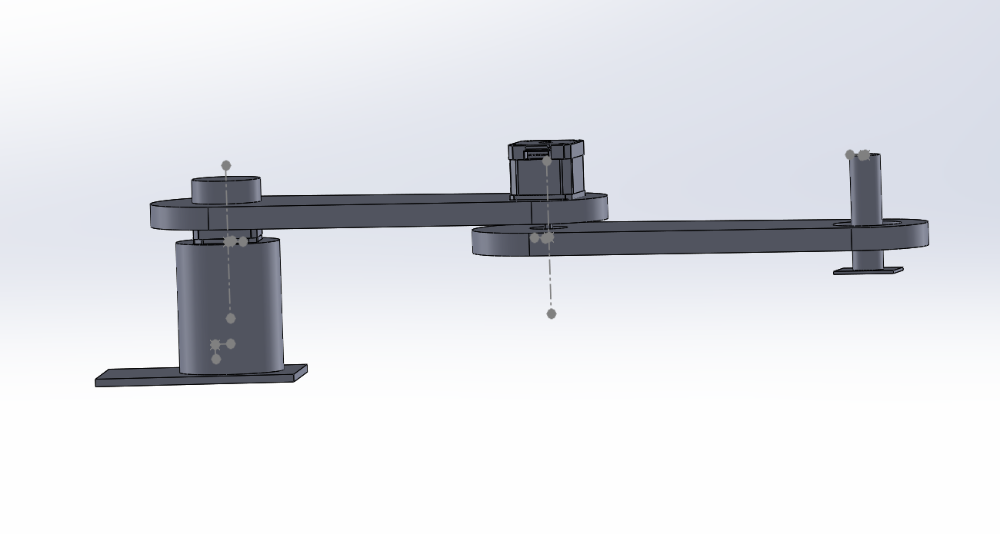
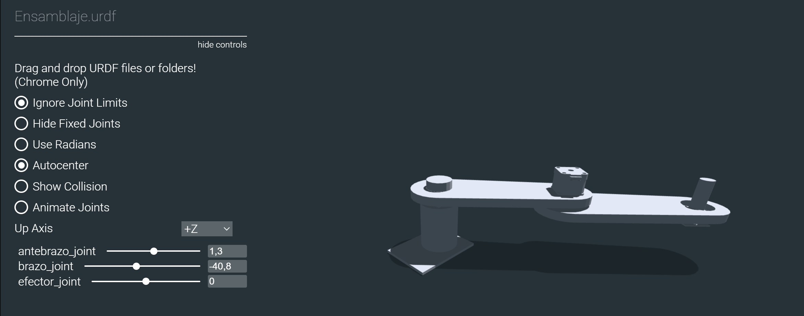
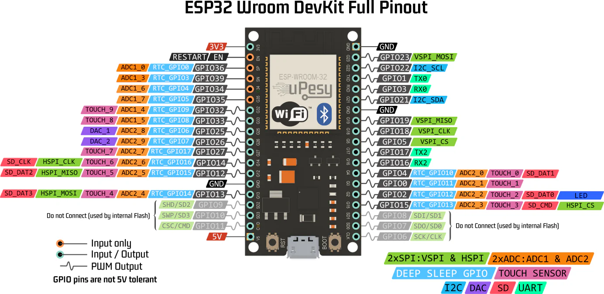
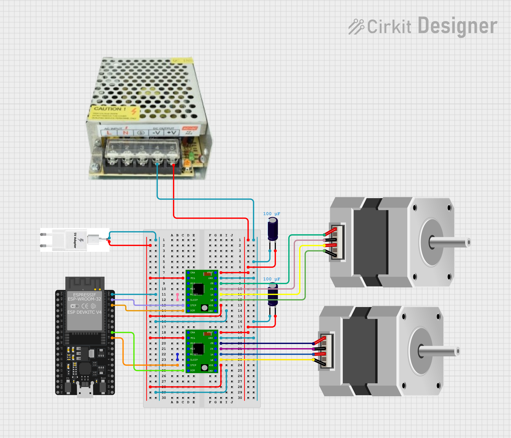

Gemelo Digital
==============

Archivos URDF
-------------

Para crear archivos URDF en base a diseños personalidados de robots con
solidworks, es necesario descargar la extensión URDF.

`Extension-Solid <https://github.com/ros/solidworks_urdf_exporter>`__,
para versiones de SolidWorks superiores a la 2021. Seleccionar la
opción: SolidWorks 2021

Una vez generado el archivo CAD con el que se va a trabajar, es
necesario configurar el arbol de juntas y eslabones del robot usando la
extensión de archivos URDF.



   Imagen

Esta extensión generará una carpeta con los documentos necesarios para
la simulación el robot. Se puede visualizar la configuración obtenida
utilizando la herramienta online
`viewer-urdf <https://gkjohnson.github.io/urdf-loaders/javascript/example/bundle/index.html>`__,
para usarlo, se debe arrastrar la carpeta generada por SolidWorks en la
pantalla de visualizador y esta generará una interfaz de manipulación
rapida del modelo obtenido.



   Ejemplo

En el siguiente enlace
`Scara-URDF <https://drive.google.com/open?id=15o6Q_H6R-In0UsSA8FMnYaNj3OwC1M9L&usp=drive_fs>`__,
se encuentra el modelo base que será utilizado para configurar el
visualizador RVIZ2 de ROS2.

Visualización de archivos URDF
------------------------------

Para visualizar y manipular el archivo URDF creado se utiliza la
herramienta RVIZ, a continuación se muestra los pasos para su
configuración.

1. Instalar paquetes necesarios

.. code:: bash

   sudo apt install ros-humble-joint-state-publisher-gui

2. Copiar archivos al paquete

Dentro del paquete ``mi_pkg_python``, se debe crear los directorios:
``urdf/meshes`` y ``launch``.

- Directorio urdf: agregar el archivo urdf generado y dentro del
  subdirectorio meshes: colocar todos los archvos STL
- Directorio launch: crear un archivo vacio
  ``visualizar_rviz.launch.py``

::

   mi_pkg_python/
   ├── urdf/
   │   ├── ensamblaje.urdf
   │   └── meshes/
   │       ├── base_link.STL
   │       └── brazo_link.STL
   │       └── antebrazo_link.STL
   │       └── efector_link.STL
   ├── launch/
   │   ├── visualizar_rviz.launch.py

nota: Es importante revisar la correcta escritura de los diferentes
archivos.

3. Verifica y edita las rutas en el URDF

Dentro de ``ensamblaje.urdf``, es necesario revisar que las rutas a las
mallas estén definidas con prefijo ``package://``, por ejemplo:

.. code:: xml

   <mesh filename="package://mi_pkg_python/urdf/meshes/base_link.STL"/>

En este punto es necesario revisar que los parámetros sean diferentes de
0, por ejemplo:

.. code:: xml

   <limit lower="-1.57" upper="1.57" effort="1.0" velocity="1.0" />


4. Modificar ``setup.py`` para instalar los recursos

Dentro de ``setup.py``, realizar la modificación del bloque
``data_files`` de la sigueinte forma:

.. code:: python

   data_files=[
       ('share/ament_index/resource_index/packages', ['resource/' + package_name]),
       ('share/' + package_name, ['package.xml']),
       ('share/' + package_name + '/urdf', ['urdf/ensamblaje.urdf']),
       ('share/' + package_name + '/urdf/meshes', [
           'urdf/meshes/base_link.STL',
           'urdf/meshes/brazo_link.STL',
           'urdf/meshes/antebrazo_link.STL',
           'urdf/meshes/efector_link.STL',
       ]),
       ('share/' + package_name + '/launch', ['launch/visualizar_rviz.launch.py']),
       ],


5. Crear el archivo de lanzamiento

Crea el archivo ``launch/visualizar_rviz.launch.py`` con el siguiente
contenido:

.. code:: python

   # Importa la clase principal para definir lanzamientos en ROS 2
   from launch import LaunchDescription

   # Importa la acción Node para lanzar nodos ROS 2
   from launch_ros.actions import Node

   # Permite obtener la ruta del directorio share de un paquete instalado
   from ament_index_python.packages import get_package_share_directory

   # Módulo estándar para trabajar con rutas de archivos
   import os

   # Función principal requerida por ROS 2 para ejecutar este archivo de lanzamiento
   def generate_launch_description():
       # Construye la ruta completa del archivo URDF dentro del paquete
       urdf_file = os.path.join(
           get_package_share_directory('mi_pkg_python'),  # Paquete que contiene el URDF
           'urdf',
           'ensamblaje.urdf'
       )

       # Devuelve la lista de nodos a lanzar
       return LaunchDescription([

           # Nodo que publica el URDF en el topic /robot_description
           Node(
               package='robot_state_publisher',
               executable='robot_state_publisher',
               name='robot_state_publisher',
               parameters=[{'robot_description': open(urdf_file).read()}]  # Carga el contenido del URDF
           ),

           # Nodo que abre una interfaz gráfica con sliders para mover las juntas
           Node(
               package='joint_state_publisher_gui',
               executable='joint_state_publisher_gui',
               name='joint_state_publisher_gui',
               output='screen'
           ),

           # Nodo que lanza RViz2 para visualizar el robot
           Node(
               package='rviz2',
               executable='rviz2',
               name='rviz2',
               output='screen'
           )
       ])

**¿Por qué se usan estos nodos?**

- ``robot_state_publisher``: publica la descripción del robot
  (``robot_description``) para que RViz2 la use.
- ``joint_state_publisher_gui``: permite mover las juntas manualmente
  mediante sliders.
- ``rviz2``: lanza la visualización.


6. Compilar y lanzar

.. code:: bash

   cd ~/ros2_ws
   colcon build --packages-select mi_pkg_python
   ros2 launch mi_pkg_python visualizar_rviz.launch.py

Manejo de datos en RVIZ con URDF.
---------------------------------

En este caso se busca crear archivos que permitan obtener y colocar
valores en las juntas del modelo URDF creado.

Los datos de las juntas se publican y escuchan utilizando el tipo de
mensaje ``JointState``

JointState
~~~~~~~~~~

El mensaje ``JointState`` representa el **estado actual de las
articulaciones** del robot.

**Campos del mensaje**

::

   Header header
   string[] name
   float64[] position
   float64[] velocity
   float64[] effort

+--------------+------------------------------------------------------------+
| Campo        | Descripción                                                |
+==============+============================================================+
| ``name``     | Lista de nombres de juntas (ej:                            |
|              | ``['brazo_joint', 'antebrazo_joint']``)                    |
+--------------+------------------------------------------------------------+
| ``position`` | Posiciones angulares o lineales actuales                   |
+--------------+------------------------------------------------------------+
| ``velocity`` | (Opcional) Velocidad de cada junta                         |
+--------------+------------------------------------------------------------+
| ``effort``   | (Opcional) Torque o esfuerzo de cada junta                 |
+--------------+------------------------------------------------------------+

..

   Solo ``name`` y ``position`` son requeridos para publicar el estado
   del robot.

**Ejemplo:**

Dentro de la carpeta mqtt_python crear los archivos  ``0_urdf_sub.py`` y ``0_urdf_pub.py``

.. tabs::

   .. group-tab:: 0_urdf_sub.py

      .. code:: python

         import rclpy
         from rclpy.node import Node
         from sensor_msgs.msg import JointState

         class JointMonitor(Node):
            def __init__(self):
               super().__init__('joint_monitor')
               self.subscription = self.create_subscription(
                     JointState,
                     '/joint_states',
                     self.callback,
                     1
               )

            def callback(self, msg):
               for i, name in enumerate(msg.name):
                     if name == "brazo_joint" or name == "antebrazo_joint" or name == "efector_joint":
                        self.get_logger().info(f"{name} → {msg.position[i]:.3f} rad")

         def main(args=None):
            rclpy.init(args=args)
            node = JointMonitor()
            rclpy.spin(node)
            node.destroy_node()
            rclpy.shutdown()

   .. group-tab:: 0_urdf_pub

      .. code:: python

         import rclpy
         from rclpy.node import Node
         from sensor_msgs.msg import JointState
         import math
         import time

         class JointPublisher(Node):
            def __init__(self):
               super().__init__('joint_publisher_manual')
               self.pub = self.create_publisher(JointState, '/joint_states', 1)
               self.timer = self.create_timer(0.1, self.publish_joints)  # 10 Hz
               self.angulo    = 0.0
               self.distancia = 0.0
               self.signo = 1

            def publish_joints(self):
               msg = JointState()
               msg.header.stamp = self.get_clock().now().to_msg()
               msg.name = ['brazo_joint', 'antebrazo_joint', 'efector_joint']
               
               # Movimiento sinusoidal para prueba
               brazo     = math.sin(self.angulo) 
               antebrazo = math.cos(self.angulo) 
               efector   = self.distancia
               
               msg.position = [brazo, antebrazo, efector]

               self.pub.publish(msg)
               self.get_logger().info(f'Publicando: brazo={brazo:.2f}, antebrazo={antebrazo:.2f}, efector {efector:.2f}')

               if self.distancia >= 0.040:
                     self.signo = -1
               
               if self.distancia <= 0.000:
                     self.signo = 1

               self.distancia += 0.001*self.signo 
               self.angulo += 0.005

         def main(args=None):
            rclpy.init(args=args)
            node = JointPublisher()
            rclpy.spin(node)
            node.destroy_node()
            rclpy.shutdown()

Agregar los programas en el setup.py para poder ejecutarlos con ROS2.


tf2
~~~

| ``tf2`` es el sistema que gestiona **transformaciones espaciales entre
  los frames** del robot.
| Permite conocer **la posición y orientación de cada parte** del robot
  en tiempo real.

ROS 2 Humble ya incluye tf2 por defecto en la mayoría de instalaciones,
pero se puede instalar instalarlo con:

.. code:: bash

   sudo apt update
   sudo apt install ros-humble-tf2 ros-humble-tf2-ros ros-humble-tf2-tools

**¿Qué hace?**

- Administra un árbol de transformaciones
- Calcula la pose de cada ``link`` con respecto a otro (``base_link``,
  ``efector_link``, etc.)
- Usa transformaciones 3D (posición + orientación con cuaterniones)


**¿Quién publica los ``tf``?**

+---------------------------+---------------------------------------------+
| Fuente                    | Transformaciones que publica                |
+===========================+=============================================+
| ``robot_state_publisher`` | Desde ``base_link`` hasta cada ``joint``    |
|                           | (usando URDF + ``/joint_states``)           |
+---------------------------+---------------------------------------------+
| SLAM / navegación         | ``map → odom``, ``odom → base_link``        |
+---------------------------+---------------------------------------------+
| Sensores / cámaras        | ``base_link → sensor_link``, etc.           |
+---------------------------+---------------------------------------------+
| Nodos personalizados      | Transforms adicionales según necesidad      |
+---------------------------+---------------------------------------------+


**¿Cómo obtener la pose del efector?**

Con ``tf2``, puedes usar:

.. code:: bash

   ros2 run tf2_ros tf2_echo base_link efector_link

**Ejemplo**

1. Dentro de la carpeta mqtt_python crear el archivo ``0_tf2.py``

.. code:: python


   # Importa las clases necesarias de tf2 para escuchar transformaciones
   from tf2_ros import TransformListener, Buffer

   # Importa la API principal de ROS 2 en Python
   import rclpy
   from rclpy.node import Node

   # Define una clase que extiende de Node para crear un nodo ROS 2
   class EffectorPose(Node):
       def __init__(self):
           # Inicializa el nodo con el nombre 'effector_pose'
           super().__init__('effector_pose')

           # Crea un buffer donde se almacenan las transformaciones
           self.tf_buffer = Buffer()

           # Crea un listener que va llenando el buffer automáticamente con los datos de /tf
           self.tf_listener = TransformListener(self.tf_buffer, self)

           # Crea un temporizador que llama a la función lookup_pose cada 0.5 segundos
           self.timer = self.create_timer(0.5, self.lookup_pose)

       # Esta función se llama periódicamente para obtener la pose del efector
       def lookup_pose(self):
           try:
               # Busca la transformación desde 'base_link' hasta 'efector_link'
               # El tiempo es "now", es decir, la transformación más reciente disponible
               t = self.tf_buffer.lookup_transform(
                   'base_link',        # Frame de referencia (padre)
                   'efector_link',     # Frame hijo (efector final)
                   rclpy.time.Time())  # Tiempo: ahora

               # Extrae la posición y orientación de la transformación
               pos = t.transform.translation
               rot = t.transform.rotation

               # Imprime por consola (logger) la pose actual del efector
               self.get_logger().info(
                   f"Pose: x={pos.x:.2f}, y={pos.y:.2f}, z={pos.z:.2f} | "
                   f"q=({rot.x:.2f}, {rot.y:.2f}, {rot.z:.2f}, {rot.w:.2f})"
               )

           except Exception as e:
               # Si ocurre algún error (ej. aún no existe la transformación), lo muestra como advertencia
               self.get_logger().warn(f"No transform: {e}")

   # Función principal que lanza el nodo
   def main(args=None):
       rclpy.init(args=args)          # Inicializa el sistema ROS 2
       node = EffectorPose()          # Crea una instancia del nodo
       rclpy.spin(node)               # Mantiene el nodo activo procesando eventos
       rclpy.shutdown()              

Agregar el codigo en el setup.py para poder ejercutarlo con ROS2.

**Nota**

Si existe un problema de dependencias al ejecutar el código, edita el
archivo package.xml y asegúrate de incluir:

::

   <exec_depend>tf2_ros</exec_depend>
   <exec_depend>geometry_msgs</exec_depend>
   <exec_depend>builtin_interfaces</exec_depend>






Conexión URDF - Steppers
------------------------

La arquitectura propuesta contempla el uso de la herramienta de visualización RViz2, 
mediante la cual se manipulan las juntas del robot definidas en un archivo URDF previamente diseñado. 
Los valores de posición de cada junta generados durante el movimiento se envían a una ESP32, encargada 
del control de posición de los actuadores a través de los drivers DM542T y A4988. La comunicación entre ROS 2 y la ESP32 se realiza mediante el protocolo MQTT, y la ejecución del movimiento en los motores paso a paso se gestiona utilizando la librería AccelStepper.

Ajuste de velocidad 15 RPM para 3 juntas (NEMA23+PG47 y 2x NEMA17)
~~~~~~~~~~~~~~~~~~~~~~~~~~~~~~~~~~~~~~~~~~~~~~~~~~~~~~~~~~~~~~~~~~

Como primer pase se realiza el calculo de ``setMaxSpeed()`` y ``setAcceleration()``
en AccelStepper para que las 3 juntas giren a la misma velocidad angular
en el eje final: 15 RPM.

Se considera el sistema descrito previamente:

- **Junta q1**: NEMA23 + driver DM542T + caja reductora PG47 ≈ 46.656:1
  con configuración del driver a 400 pulse/rev (motor).
- **Juntas q2 y q3**: NEMA17, con resolución usada
  en el código: 0.9°/paso, equivalente a 400 pasos/vuelta.

.. important::

   AccelStepper usa unidades:
   - ``setMaxSpeed(steps_per_second)``
   - ``setAcceleration(steps_per_second_squared)``

1. Datos del sistema (pasos por vuelta del eje final)

*Junta q1 (NEMA23 + PG47)*

Configuración:

- Pulsos por vuelta del motor (por microstepping del driver): :math:`N_{motor}=400`
- Relación reductora: :math:`R=46.656`

Pulsos por vuelta del eje de salida:

.. math::

   N_{q1} = N_{motor}\cdot R = 400 \cdot 46.656 = 18662.4 \;\approx\; 18662

se obtiene ``gradosPorPaso = 0.01929°``

*Juntas q2 y q3 (NEMA17 directos)*

Considerando la configuración del driver a4988 de 400 pul/rev se obtiene ``gradosPorPaso = 0.9°``

2. Conversión general RPM → steps/s

Para cualquier junta con :math:`N` pasos/vuelta en el eje final, si se desea una
velocidad :math:`RPM`, la velocidad en pasos/segundo es:

.. math::

   v_{steps} = \frac{RPM \cdot N}{60}

3. setMaxSpeed para 15 RPM

Junta q1 (NEMA23 + PG47)

.. math::

   v_{q1} = \frac{15 \cdot 18662.4}{60} = 4665.6 \;\approx\; 4666 \; \text{steps/s}

**Resultado recomendado:**

.. code-block:: cpp

   motor1.setMaxSpeed(4666);

Juntas q2 y q3 (NEMA17)

.. math::

   v_{q2} = v_{q3} = \frac{15 \cdot 400}{60} = 100 \;\text{steps/s}

**Resultado recomendado:**

.. code-block:: cpp

   motor2.setMaxSpeed(100);
   motor3.setMaxSpeed(100);

4. Conversión general aceleración (RPM/s) → steps/s²

La aceleración en AccelStepper también se define en pasos por segundo cuadrado.

Si quieres que todas las juntas tengan aceleración similar en el eje final,
elige una aceleración en RPM por segundo (:math:`RPM/s`) y conviértela:

.. math::

   a_{steps} = \frac{(RPM/s)\cdot N}{60}

5. setAcceleration recomendado (rampa de 1 segundo)

Una elección práctica para "aceleración similar" es:

- Llegar de 0 a 15 RPM en ~1 segundo

Eso equivale a:

.. math::

   (RPM/s) = 15

5.1 Junta q1 (NEMA23 + PG47)

.. math::

   a_{q1} = \frac{15 \cdot 18662.4}{60} = 4665.6 \;\approx\; 4666 \;\text{steps/s}^2

.. code-block:: cpp

   motor1.setAcceleration(4666);

5.2 Juntas q2 y q3 (NEMA17)

.. math::

   a_{q2} = a_{q3} = \frac{15 \cdot 400}{60} = 100 \;\text{steps/s}^2

.. code-block:: cpp

   motor2.setAcceleration(100);
   motor3.setAcceleration(100);

6. Bloque de configuración completo (15 RPM, rampa 1 s)

.. code-block:: cpp

   // --- Pasos por vuelta del eje final ---
   const float stepsPerRev_q1 = 400.0f * 46.656f; // 18662.4
   const float stepsPerRev_q2 = 400.0f;           // si 0.9°/paso
   const float stepsPerRev_q3 = 400.0f;

   // --- Objetivo ---
   const float rpm_target = 15.0f;

   // --- Velocidad steps/s ---
   const float v1 = (rpm_target * stepsPerRev_q1) / 60.0f;  // ~4665.6
   const float v2 = (rpm_target * stepsPerRev_q2) / 60.0f;  // 100
   const float v3 = (rpm_target * stepsPerRev_q3) / 60.0f;  // 100

   motor1.setMaxSpeed(v1);
   motor2.setMaxSpeed(v2);
   motor3.setMaxSpeed(v3);

   // --- Aceleración: llegar a 15 RPM en ~1s (15 RPM/s) ---
   const float rpm_per_s = 15.0f;

   const float a1 = (rpm_per_s * stepsPerRev_q1) / 60.0f;   // ~4665.6
   const float a2 = (rpm_per_s * stepsPerRev_q2) / 60.0f;   // 100
   const float a3 = (rpm_per_s * stepsPerRev_q3) / 60.0f;   // 100

   motor1.setAcceleration(a1);
   motor2.setAcceleration(a2);
   motor3.setAcceleration(a3);

   // Recomendado para DM542T (pulso seguro)
   motor1.setMinPulseWidth(5);

7. Notas prácticas (muy importantes)

- Aunque las ecuaciones igualan velocidad y aceleración en el eje final, la
  sensación real puede variar por:
  - carga/inercia distinta en cada junta
  - fricción y backlash de la reductora
  - límites de torque y alimentación

- Si alguna junta pierde pasos o vibra, baja primero ``setAcceleration()``
  (la aceleración suele ser la causa principal).

- Si q2 y q3 no están realmente a 0.9°/paso (microstepping distinto),
  debes recalcular :math:`N_{q2}` y :math:`N_{q3}`.

Codigos control - MQTT:  
~~~~~~~~~~~~~~~~~~~~~~~
- ``control_stepper.py`` Envia un mensaje JSON con el delta del angulo que debe mover la junta *q1 o q2*.
- ``ESP32`` Recibe los mensajes y realiza el movimiento del stepper de cada junta de forma relativa.

.. tabs::

   .. group-tab:: python

      Dentro de la carpeta ``mqtt_python`` crear el archivo control_stepper.py

      .. code:: python

         import paho.mqtt.client as mqtt
         import json
         import time

         # Configuración del broker
         BROKER            = "192.168.100.178" # Ip del computador o localhost
         TOPIC_SUB_SEN     = "ra/sensores"
         TOPIC_SUB_EST     = "ra/estados"
         TOPIC_PUB         = "ra/juntas"
         CLIENT_ID         = "cliente_rm1"

         # Callback cuando se conecta al broker
         def on_connect(client, userdata, flags, rc, properties=None):
            if rc == 0:
               print("Conectado al broker MQTT")
               client.subscribe(TOPIC_SUB_SEN)
               client.subscribe(TOPIC_SUB_EST)

            else:
               print(f"Error de conexión: código {rc}")

         # Callback al recibir un mensaje
         def on_message(client, userdata, msg):
            try:
               mensaje = msg.payload.decode("utf-8")
               data = json.loads(mensaje)
               if msg.topic == TOPIC_SUB_SEN:
                     print("Mensaje recido del Equipo2 Ultrasónico:", data["ultra"])
               
               if msg.topic == TOPIC_SUB_EST:
                     print("Mensaje recido del Equipo2 Estado:", data["Estado"])

            except Exception as e:
               print("Error procesando mensaje:", e)

         client = mqtt.Client(client_id=CLIENT_ID, protocol=mqtt.MQTTv311)

         # Asociar funciones de callback
         client.on_connect = on_connect
         client.on_message = on_message

         # Conexión al broker
         client.connect(BROKER)

         # Iniciar loop en segundo plano
         client.loop_start()

         # Envío continuo de mensajes cada segundo
         try:
            while True:
               payload = {
                     "q1": 80,
                     "q2": 80,
                     "avanzar": 1
                     }
               mensaje = json.dumps(payload)
               client.publish(TOPIC_PUB, mensaje)
               #print("Publicado en datos_1:", payload)
               time.sleep(5)

         except KeyboardInterrupt:
            print("\n Finalizando conexión MQTT...")

         finally:
            client.loop_stop()
            client.disconnect()
            print(" Desconectado correctamente.")

   .. group-tab:: Esp32 MQTT

      Pestaña 1 del codigo de la ESP32.

      .. code:: cpp

         #include <PubSubClient.h>
         #include <WiFi.h>
         #include <ArduinoJson.h>
         #include <AccelStepper.h>

         // Pines motores paso a paso
         #define STEP2 18
         #define DIR2  19
         #define STEP3 22
         #define DIR3  23

         // Pines Driver
         static const int PIN_STEP = 25;  // -> PUL+
         static const int PIN_DIR  = 27;  // -> DIR+

         // --------------------
         // Config según tu DIP: 400 pulse/rev (del motor)
         // Reductora: PG47  46.656:1
         // --------------------

         static const long PULSES_PER_REV_MOTOR = 400;
         static const float GEAR_RATIO = 46.656f;

         static const long PULSES_PER_REV_OUT = (long)(PULSES_PER_REV_MOTOR * GEAR_RATIO);

         // Convierte grados del eje de salida a pulsos
         long outDegreesToPulses(float deg_out) {
         float pulses = (deg_out / 360.0f) * (float)PULSES_PER_REV_OUT;
         return lroundf(pulses);
         }

         AccelStepper motor1(AccelStepper::DRIVER, PIN_STEP, PIN_DIR);
         AccelStepper motor2(AccelStepper::DRIVER, STEP2, DIR2);  // Q1
         AccelStepper motor3(AccelStepper::DRIVER, STEP3, DIR3);  // Q2


         float gradosPorPaso = 0.9;

         // Variable de Control Alarmar
         int activar  = 0;
         int estado   = 0;
         int ultra    = 0;

         // GPIO de salidad Digital
         int pin_led   = 2;

         //  Credenciales Wifi
         const char* ssid = "CARMEN GONZALEZ_";
         const char* password = "123wa321vg";

         // Credenciales MQTT
         const char* mqtt_broker = "192.168.100.76";
         const int mqtt_port     = 1883;
         const char* cliente     = "rm1_esp32";

         // Temas MQTT Publicar
         const char* tema_sub     = "ra/juntas";
         const char* tema_pub_est = "ra/estados";
         const char* tema_pub_sen = "ra/sensores";

         // Variables de control de tiempo
         unsigned long lastTime = 0;

         // Creacion del objeto cliente
         WiFiClient espClient;
         PubSubClient client(espClient);

         // Tamaño de mensaje JSON
         const size_t capacidad_json = JSON_OBJECT_SIZE(30);


         void setup() {
         // Setup Serial
         Serial.begin(115200);
         // Setup Wifi
         setup_wifi();
         // Setup MQTT
         conexion();
         // Manejo del rele
         pinMode(pin_led, OUTPUT);

         // NEMA 23
         // AccelStepper
         motor1.setMaxSpeed(4665.6);       // pulsos/seg (ojo: a mayor, más exigente)
         motor1.setAcceleration(3110);   // pulsos/seg^2
         motor1.setMinPulseWidth(5);     // us (seguro para DM542T)

         // NEMA 17
         motor2.setMaxSpeed(99.9);     
         motor2.setAcceleration(66.7);
         motor2.setPinsInverted(true, false, false); //
         motor3.setMaxSpeed(200);
         motor3.setAcceleration(100);

         // Referencia inicial (si estás arrancando desde "cero")
         motor1.setCurrentPosition(0);
         motor2.setCurrentPosition(0);
         motor3.setCurrentPosition(0);
         }

         void loop() {
         Loop_MQTT();
         motor1.run();
         motor2.run();
         motor3.run();

         if (millis() - lastTime >= 100){
            estado = 1;
            ultra = ultra+1;
            envioDatos(tema_pub_est, estado, ultra);
            envioDatos(tema_pub_sen, estado, ultra);
            lastTime = millis();
         }
         if (activar == 1){
            digitalWrite(pin_led, HIGH);  // Enciende el LED

            }
         else {
            digitalWrite(pin_led, LOW);  // Enciende el LED
         }

         }


   .. group-tab:: conf_mqtt
   
      Pestaña 2 del codigo de la ESP32

      .. code:: cpp

         void setup_wifi() {
         // Conexión Wifi
         delay(10);
         Serial.println();
         Serial.print("Conectando a ");
         Serial.println(ssid);
         WiFi.begin(ssid, password);
         while (WiFi.status() != WL_CONNECTED) {
            delay(500);
            Serial.print(".");
         }
         Serial.println("");
         Serial.print("WiFi conectado - Dirección IP del ESP: ");
         Serial.println(WiFi.localIP());
         }

         void reconnect() {
         // Control de conexión MQTT
         while (!client.connected()) {
            Serial.print("Intentando conexión MQTT...");
            if (client.connect(cliente)) {
               Serial.println("Conectado");
               // Suscripción a TEMAS
               client.subscribe(tema_sub, 1);
            } else {
               Serial.print("Falló, rc=");
               Serial.print(client.state());
               Serial.println("Intentando de nuevo en 2 segundos");
               delay(2000);
            }
         }
         }

         void conexion() {
         // Conexión MQTT
         client.setServer(mqtt_broker, mqtt_port);
         client.setCallback(callback);
         }

         void Loop_MQTT() {
         // Manejo MQTT
         if (!client.connected()) {
            reconnect();
         }
         client.loop();
         }

         void envioDatos(const char* mqtt_topic_publicar, int estado, int ultra) {
         DynamicJsonDocument mensaje(256);

         if (mqtt_topic_publicar == tema_pub_est) {
            mensaje["estado"]   = estado;
            String mensaje_json;
            serializeJson(mensaje, mensaje_json);
            client.publish(mqtt_topic_publicar, mensaje_json.c_str(), 1);
         }

         if (mqtt_topic_publicar == tema_pub_sen) {
            mensaje["ultra"]   = ultra;
            String mensaje_json;
            serializeJson(mensaje, mensaje_json);
            client.publish(mqtt_topic_publicar, mensaje_json.c_str(), false);
         }


         }

         void callback(char* topic, byte* payload, unsigned int length) {
         StaticJsonDocument<capacidad_json> doc;
         char buffer[length + 1];
         memcpy(buffer, payload, length);
         buffer[length] = '\0';  // Asegura que el buffer tenga fin de cadena

         DeserializationError error = deserializeJson(doc, buffer);

         if (error) {
            Serial.print("Error al deserializar JSON: ");
            Serial.println(error.c_str());
            return;
         }

         String topico(topic);
         if (topico == "ra/juntas") {
            if (doc.containsKey("q1") && doc.containsKey("q2") && doc.containsKey("q3")) {
               float q1 = doc["q1"]; // NEMA 23
               float q2 = doc["q2"]; // NEMA 17
               float q3 = doc["q3"]; // NEMA 17

               long pasos1 = outDegreesToPulses(q1);
               int pasos2 = round(q2 / gradosPorPaso);
               int pasos3 = round(q3 / gradosPorPaso);

               Serial.print("Recibido q1: ");
               Serial.print(q1);
               Serial.print(" → pasos: ");
               Serial.print(pasos1);


               Serial.print("Recibido q2: ");
               Serial.print(q2);
               Serial.print(" → pasos: ");
               Serial.print(pasos2);

               Serial.print(" Recibido q3: ");
               Serial.print(q3);
               Serial.print(" → pasos: ");
               Serial.println(pasos3);
               
               // movimiento q1
               motor1.move(pasos1);
               // Movimiento NEMA Q2 y Q3
               motor2.move(pasos2);
               motor3.move(pasos3);
            }

            if (doc.containsKey("avanzar")) {
               activar = doc["avanzar"];
            }
         }
         }


ROS2 y el control de stepper
----------------------------

Con el fin de poder reflejar los movimientos del robot Simulado en RVIZ2 y del
robot real, se aplica la combinación de los códigos de ``mqtt_bridge`` y
``urdf_sub``.

Dentro de la carpeta ``mqtt_python``, crear el archivo ``urdf_mqtt```.

.. code:: python

   import rclpy
   from rclpy.node import Node
   from rclpy.duration import Duration
   from std_msgs.msg import Float32, Int32
   from sensor_msgs.msg import JointState

   import paho.mqtt.client as mqtt
   import json

   import math

   class MQTTBridge(Node): 
       def __init__(self):
           super().__init__('mqtt_bridge')

           # Angulos del robot
           self.real_q1 = 0.0
           self.real_q2 = 0.0
           self.real_q3 = 0.0

           self.pub = self.create_publisher( Float32, 'sensor_bateria', 1)
           self.subscription = self.create_subscription(
               JointState, 
               '/joint_states', 
               self.listener_ros, 1
               )

           self.last_data = None
           self.active = True  # control de publicación activa
           self.last_mqtt_time = self.get_clock().now()

           self.timer = self.create_timer(0.1, self.publish_sensor_data)       # Publicador (10 Hz)
           self.timer_watchdog = self.create_timer(0.5, self.check_timeout)    # Verificador de tiempo

           self.topic_sub = "ra/sensores"
           self.topic_pub = "ra/juntas"
           self.mqtt_client = mqtt.Client()
           self.mqtt_client.on_connect = self.on_connect
           self.mqtt_client.on_message = self.on_message
           self.mqtt_client.connect("192.168.100.178", 1883, 60)
           self.mqtt_client.loop_start()

       def listener_ros(self, msg):
           q1_mov = 0.0
           q2_mov = 0.0
           q3_mov = 0.0
           for i, name in enumerate(msg.name):
               # Resolucion del stepper 0.9
               if name == "brazo_joint":
                   meta = round(math.degrees(msg.position[i]),4)
                   self.real_q1, q1_mov = self.mover_a_angulo_discreto(meta,self.real_q1)
               if name == "antebrazo_joint":
                   meta = round(math.degrees(msg.position[i]),4)
                   self.real_q2, q2_mov = self.mover_a_angulo_discreto(meta,self.real_q2)

           payload = {
                       "q1": q1_mov,
                       "q2": q2_mov
                     }
           msg_mqtt = json.dumps(payload)
           self.mqtt_client.publish(self.topic_pub, msg_mqtt)
           print("Mensaje Enviado")
       
       def mover_a_angulo_discreto(self, angulo_objetivo, angulo_actual, paso=0.9):
           """
           Calcula el desplazamiento al múltiplo de 'paso' más cercano al ángulo objetivo.
           Retorna:
               - el nuevo ángulo corregido (múltiplo de paso)
               - el desplazamiento angular necesario desde el ángulo actual
           """

           # Calcula desplazamiento
           desplazamiento = angulo_objetivo - angulo_actual

           # Redondea el ángulo objetivo al múltiplo más cercano
           desplazamiento_valido = round(desplazamiento / paso) * paso

           meta_ajustada = angulo_actual + desplazamiento_valido
           print(f"[INFO] Objetivo :{angulo_objetivo}°")
           print(f"[INFO] Objetivo ajustado: {meta_ajustada}° (múltiplo de {paso}°)")
           print(f"[INFO] Desplazamiento desde actual: {desplazamiento_valido:.2f}°")

           return round(meta_ajustada,2), round(desplazamiento_valido,2)


       def on_connect(self, client, userdata, flags, rc):
           if rc == 0:
               print("Conectado al broker MQTT")
               client.subscribe(self.topic_sub)
           else:
               print(f"Error de conexión: código {rc}")

       def on_message(self, client, userdata, msg):
           try:
               mensaje = msg.payload.decode("utf-8")
               data = json.loads(mensaje)
               if msg.topic == self.topic_sub:
                   self.last_data = float(data["bateria"])
                   self.last_mqtt_time = self.get_clock().now()  # Actualiza tiempo del último dato
                   self.active = True
           except Exception as e:
               print("Error procesando mensaje:", e)

       def publish_sensor_data(self):
           if self.last_data is not None and self.active:
               ros_msg = Float32()
               ros_msg.data = self.last_data
               self.pub.publish(ros_msg)
               self.get_logger().info(f"ROS2 publicó: {ros_msg.data}")

       def check_timeout(self):
           now = self.get_clock().now()
           if now - self.last_mqtt_time > Duration(seconds=2.0):
               if self.active:
                   self.get_logger().warn("No se reciben datos desde MQTT. Se detiene la publicación.")
               self.active = False

   def main(args=None):
       rclpy.init(args=args)
       node = MQTTBridge()
       try:
           rclpy.spin(node)
       except KeyboardInterrupt:
           pass
       rclpy.shutdown()


Registrar el codigo en el ``setup.py`` y compilar 

.. code:: bash

   cd ~/ros2_ws
   colcon build --packages-select mi_pkg_python

Para ejecutar el programa lanzar los archivos:

.. code:: bash

   ros2 launch mi_pkg_python visualizar_rviz.launch.py
   ros2 run mi_pkg_python urdf_mqtt