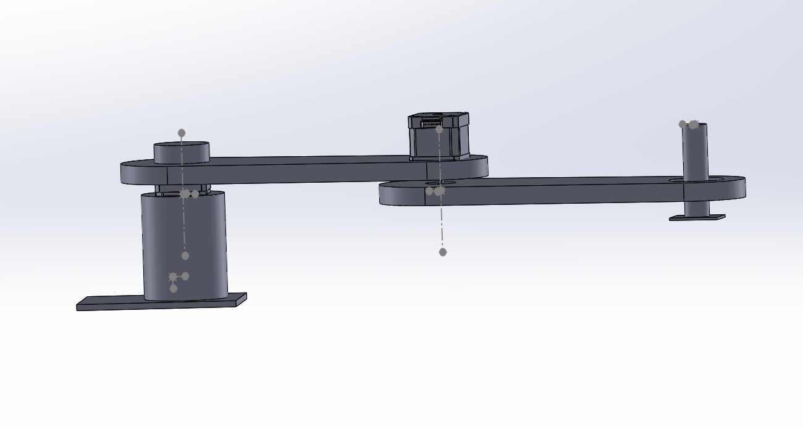
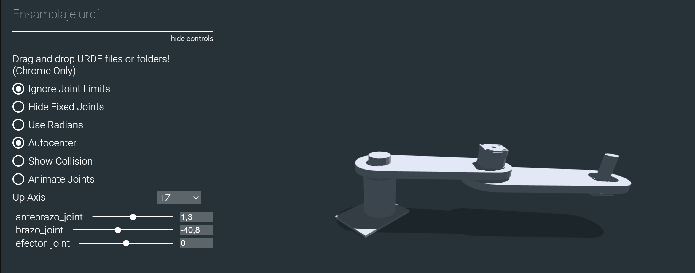

# URDF

Para crear archivos URDF en base a diseños personalidados de robots con solidworks, es necesario gescargar la extensión URDF.

[Extension-Solid](https://github.com/ros/solidworks_urdf_exporter), para versiones de SolidWorks superiores a la 2021. Seleccionar la opción: SolidWorks 2021 Extensión.

Una vez generado el solid con el que se va a trabajar es necesario configurar el arbol de juntas y eslabones del robot usando la extensión de archivos URDF.



Esta extensión generará una carpeta ZIP, con los documentos necesarios para simular el robot.

Se puede visualizar si se configuró bien el archivo usando el siguiente link:

[visualizador](https://gkjohnson.github.io/urdf-loaders/javascript/example/bundle/index.html)

Para usar la herramienta de visualización en linea es necesario unicamente arrastrar la carpeta generada por la extensión URDF de solidWorks.

Puede utilizar la configuración realizada para este ejemplo:

[Scara-URDF](https://drive.google.com/open?id=15o6Q_H6R-In0UsSA8FMnYaNj3OwC1M9L&usp=drive_fs)

## Visualización de archivos URDF 

Para visualizar y manipular el archivo URDF creado se utiliza la herramienta RVIZ2.

1. Instalar herramientas necesarias

```bash
sudo apt install ros-humble-joint-state-publisher-gui
```

---

2.  Copiar archivos al paquete

Dentro de tu paquete `mi_pkg_python`, organiza los directorios y documentos de la siguiente forma:

Dentro del directorio urdf: Agregar el archivo urdf generado y dentro del subdirectorio meshes: colocar todos los archvos .STL, finalmente crear el directorio launch y dentro el archivo visualizar_rviz.launch.py

```
mi_pkg_python/
├── urdf/
│   ├── ensamblaje.urdf
│   └── meshes/
│       ├── base_link.STL
│       └── brazo_link.STL
│       └── antebrazo_link.STL
│       └── efector_link.STL
├── launch/
│   ├── visualizar_rviz.launch.py
```

---

3. Verifica y edita las rutas en el URDF

Dentro de `ensamblaje.urdf`, es necesario revisar que las rutas a las mallas estén definidas con prefijo `package://`, por ejemplo:

```xml
<mesh filename="package://mi_pkg_python/urdf/meshes/base_link.STL"/>
```

---

4. Modificar `setup.py` para instalar los recursos

Dentro de `setup.py`, asegúrate de que el bloque `data_files` contenga:

```python
data_files=[
    ('share/ament_index/resource_index/packages', ['resource/' + package_name]),
    ('share/' + package_name, ['package.xml']),
    ('share/' + package_name + '/urdf', ['urdf/ensamblaje1.urdf']),
    ('share/' + package_name + '/urdf/meshes', [
        'urdf/meshes/base_link.STL',
        'urdf/meshes/brazo_link.STL',
        'urdf/meshes/antebrazo_link.STL',
        'urdf/meshes/efector.STL',
    ]),
    ('share/' + package_name + '/launch', ['launch/visualizar_rviz.launch.py']),
    ],
```

---

5. Crear el archivo de lanzamiento

Crea el archivo `launch/visualizar_rviz.launch.py` con el siguiente contenido:

```python
# Importa la clase principal para definir lanzamientos en ROS 2
from launch import LaunchDescription

# Importa la acción Node para lanzar nodos ROS 2
from launch_ros.actions import Node

# Permite obtener la ruta del directorio share de un paquete instalado
from ament_index_python.packages import get_package_share_directory

# Módulo estándar para trabajar con rutas de archivos
import os

# Función principal requerida por ROS 2 para ejecutar este archivo de lanzamiento
def generate_launch_description():
    # Construye la ruta completa del archivo URDF dentro del paquete
    urdf_file = os.path.join(
        get_package_share_directory('mi_pkg_python'),  # Paquete que contiene el URDF
        'urdf',
        'ensamblaje.urdf'
    )

    # Devuelve la lista de nodos a lanzar
    return LaunchDescription([

        # Nodo que publica el URDF en el topic /robot_description
        Node(
            package='robot_state_publisher',
            executable='robot_state_publisher',
            name='robot_state_publisher',
            parameters=[{'robot_description': open(urdf_file).read()}]  # Carga el contenido del URDF
        ),

        # Nodo que abre una interfaz gráfica con sliders para mover las juntas
        Node(
            package='joint_state_publisher_gui',
            executable='joint_state_publisher_gui',
            name='joint_state_publisher_gui',
            output='screen'
        ),

        # Nodo que lanza RViz2 para visualizar el robot
        Node(
            package='rviz2',
            executable='rviz2',
            name='rviz2',
            output='screen'
        )
    ])
```

**¿Por qué se usan estos nodos?**

- `robot_state_publisher`: publica la descripción del robot (`robot_description`) para que RViz la use.
- `joint_state_publisher_gui`: permite mover las juntas manualmente mediante sliders.
- `rviz2`: lanza la visualización.

---

6. Compilar y lanzar

```bash
cd ~/ros2_ws
colcon build --packages-select mi_pkg_python
source install/setup.bash
ros2 launch mi_pkg_python visualizar_rviz.launch.py
```

